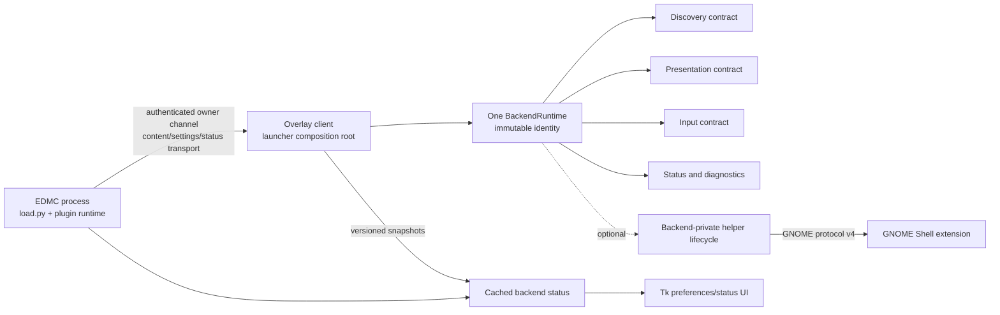
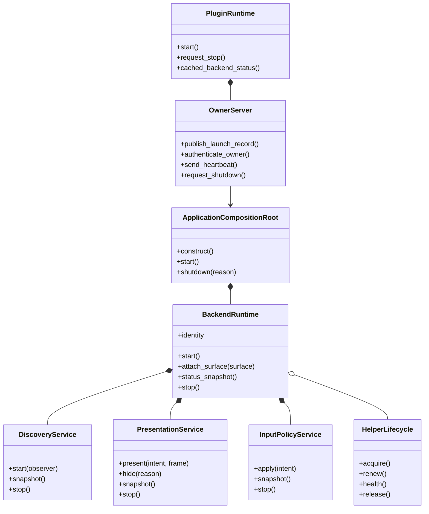
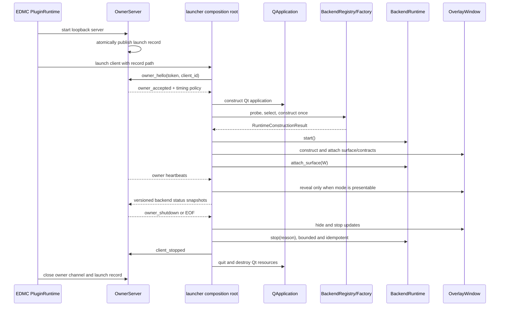
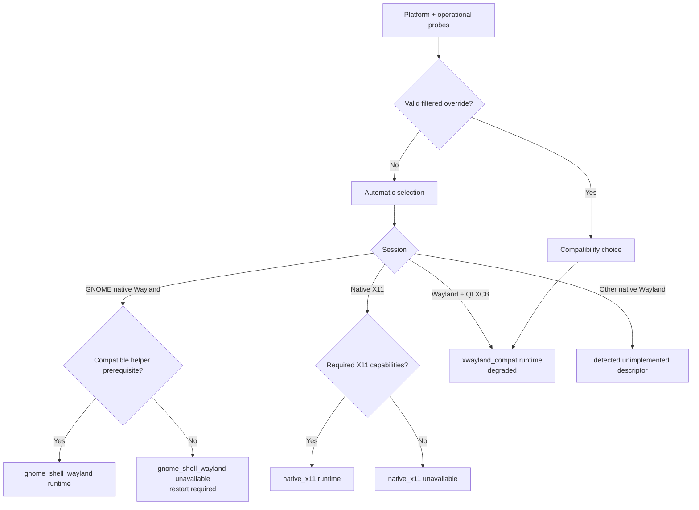
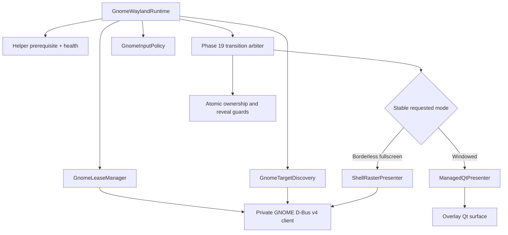
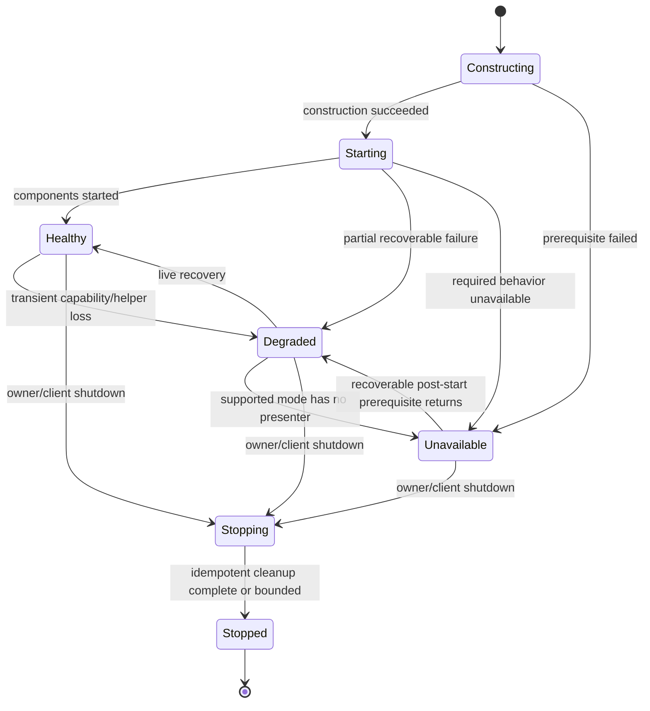
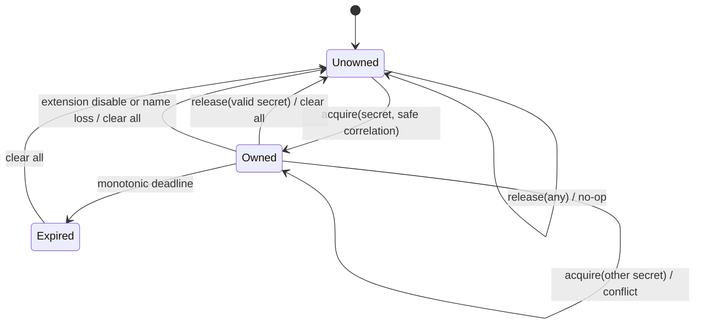

# Detailed Design: fix219 Architecture Convergence

## Document Status

| Phase | Stage | Description | Status |
| --- | --- | --- | --- |
| 6 | 6.1 | Verify the handoff, repository state, and PDD artifacts | Completed |
| 6 | 6.2 | Consolidate requirements and research decisions | Completed |
| 6 | 6.3 | Define the converged architecture, contracts, and data models | Completed |
| 6 | 6.4 | Define migration, error handling, testing, validation, and compliance gates | Completed |
| 6 | 6.5 | Review the detailed design with the user | Completed |

This document is the proposed detailed design. It does not authorize implementation. Implementation planning begins only after explicit user approval of this design.

## Overview

### Purpose

This project completes the remaining `fix219` architectural convergence after the existing cross-platform backend refactor and GNOME Wayland Phase 19 presentation work. The result is one overlay-client composition root that constructs and owns one selected backend runtime for the process lifetime. Generic discovery, presentation, input, lifecycle, status, and diagnostic code reach compositor behavior only through backend-owned contracts.

The first supported Linux environments are:

- GNOME Shell 46 and newer on native Wayland.
- GNOME Shell/Mutter on native X11 through the shared `native_x11` runtime.
- Ubuntu 24.04.4 LTS as the initial required distribution.

XWayland remains a distinct degraded compatibility runtime. Other detected Wayland environments remain explicit unimplemented descriptors until their own projects provide operational probes, backend behavior, automated contracts, and environment validation.

### Outcome

The converged system has these defining properties:

1. `overlay_client.launcher.main()` is the production composition root.
2. The composition root constructs exactly one immutable backend identity and one matching process-lifetime `BackendRuntime`.
3. Presentation, input, discovery, helper lifecycle, and cleanup behavior live behind backend-owned contracts.
4. GNOME native Wayland is one backend identity. Its runtime selects managed PyQt for supported windowed presentation and GNOME Shell raster for supported borderless fullscreen presentation.
5. Native X11 and XWayland remain separate identities even when they reuse XCB and X11 tracking mechanisms.
6. Support policy, validation evidence, and live runtime health are independent status dimensions.
7. EDMC, the overlay client, and external helpers form a bounded hierarchical ownership chain.
8. The migration is contract-first and reversible until parity and the required validation matrix are proven.
9. Overlay content, rendering commands, layout/group payloads, third-party integrations, and non-backend preferences remain behaviorally compatible.

### Design principles

- **Lift then prove:** move existing GNOME behavior intact behind contracts before reshaping state machines or splitting modules.
- **One owner per lifetime:** the launcher owns the runtime; the runtime owns every resource it creates.
- **Behavior over identity:** generic consumers request discovery, presentation, or input behavior and never inspect compositor-private enums.
- **Fail closed:** unsupported or unproven presentation never becomes visible through an incapable fallback.
- **Evidence over labels:** operational capability probes and environment validation determine claims; compositor names alone do not.
- **Bounded cleanup:** owner loss and helper lease expiry release resources without relying on successful shutdown callbacks.
- **Cheap release paths:** detailed diagnostics and timing remain developer/diagnostic gated.

### Scope

In scope:

- One overlay-client composition root and one selected runtime.
- Backend behavioral contracts and operational capability evidence.
- GNOME native-Wayland runtime ownership and one GNOME backend identity.
- Native X11 support under GNOME/Mutter, with an optional narrow window-manager policy seam.
- XWayland as a degraded compatibility runtime.
- Authenticated EDMC-to-client ownership and liveness.
- GNOME helper ownership leases and independent expiry cleanup.
- Versioned backend settings/status control plane.
- Cached or pushed plugin status that does not wait synchronously from Tk callbacks.
- Support/evidence artifacts, privacy-conscious diagnostics, performance comparison, EDMC compliance, and reusable backend contract tests.
- A future-backend implementation guide and deterministic paper/example backend.

Out of scope:

- KDE/KWin, wlroots, Sway, Wayfire, Hyprland, COSMIC, gamescope, or generic layer-shell implementations.
- Mixed per-monitor scaling, vertical monitor layouts, and runtime primary-monitor changes.
- Exclusive fullscreen.
- A managed-PyQt borderless-fullscreen fallback on GNOME Wayland.
- A behavioral capture-policy interface.
- Windows composition redesign, portal fallback implementation, geometry/follow redesign, or Linux standalone redesign.
- Runtime switching between backend identities without restarting the overlay client.
- Compatibility for old backend settings or backend control-plane schemas.

## Detailed Requirements

### Support and validation requirements

1. Project support policy targets GNOME Shell 46, 47, 48, 49, and 50. Newer versions require porting-guide review and smoke validation before being added.
2. Release claims distinguish the target policy from the exact validation evidence accumulated for each environment.
3. GNOME Shell 46 on Ubuntu 24.04.4 LTS must pass the full native-Wayland and native-X11 acceptance matrix.
4. GNOME Shell 47–50 may use maintainer smoke or structured community evidence. Lack of reports does not silently become a validation claim.
5. Primary supported Elite display modes are windowed and borderless fullscreen. Exclusive fullscreen is unsupported by this project.
6. The initial scale matrix is uniform 100% and uniform 125%.
7. The initial monitor matrix is two horizontal monitors, handoffs in both directions, and at least one negative-coordinate arrangement.
8. Mixed per-monitor scale, vertical layouts, and primary-monitor changes are documented validation gaps.
9. XWayland receives automated contract/status coverage and a basic GNOME Wayland smoke test, but not the full native matrix.
10. Other X11 window managers may remain operational when probes pass but are `unvalidated_operational`; they do not inherit the GNOME/Mutter support claim.
11. Support policy, validation evidence, and current health are always represented independently.

### Runtime composition requirements

1. The launcher constructs one production backend runtime after `QApplication` and initial settings exist and before the overlay can be shown.
2. Backend identity is immutable for the overlay-client lifetime. Session, platform, or override changes that select another identity require restart.
3. Transient target, monitor, scale, display-mode, helper-health, presentation, and renderer-state changes are handled by the active runtime without reconstruction.
4. Selection and construction cannot disagree: a successful construction result contains the exact selected identity, while a failed construction produces a normalized unavailable runtime/status for that same identity.
5. `load.py` remains backend-neutral and does not import or invoke private GNOME presentation code.
6. Generic launcher, lifecycle, follow, status, and diagnostic consumers contain no compositor-private dispatch.

### Backend contract requirements

1. Discovery, presentation, and input are separate behavioral contracts.
2. One concrete backend object may implement multiple contracts, but bundle composition and tests cannot require object identity between them.
3. Presentation owns prepare/present/hide/update/transition/teardown behavior and returns normalized results.
4. Input owns click-through, focus acceptance, and interaction-state behavior.
5. Discovery owns target lifecycle and normalized snapshots.
6. Helper lifecycle exposes generic availability, compatibility, health, ownership, release, and sanitized diagnostic behavior. GNOME D-Bus names, payloads, tokens, renderers, and transition actions remain private.
7. Capture-related vocabulary is reserved in capability evidence, but no `CapturePolicyBackend` is introduced.
8. Every future backend must supply operational probes, runtime composition, applicable behavior, lifecycle cleanup, truthful status, sanitized diagnostics, contract tests, and environment evidence.

### GNOME native-Wayland requirements

1. `gnome_shell_wayland` is the only production GNOME Wayland backend identity.
2. `gnome_shell_raster` is removed as a production identity and manual override after migration.
3. The runtime owns presenter selection: managed PyQt for supported windowed mode and Shell raster for supported borderless fullscreen.
4. A compatible helper is a construction-time prerequisite. Missing, disabled, or incompatible helper state is unavailable and restart-required.
5. A transient helper failure after successful construction hides any mode that no valid presenter can satisfy and permits live recovery within the same runtime.
6. Borderless fullscreen never exposes a managed-PyQt fallback. Windowed mode may continue using managed PyQt when it remains valid.
7. The runtime owns GNOME startup recovery, presentation state, lease renewal, and idempotent bounded cleanup.
8. A healthy helper owner cannot be preempted by another client.
9. The helper independently expires all externally hosted state if the client disappears.
10. One coordinated helper protocol bump is permitted after composition parity; dual protocol support is not required.

### Phase 19 preservation requirements

The architecture migration must preserve:

- The injectable 1.5-second fullscreen transition grace period.
- No immediate renderer transfer on a single transient `fullscreen=false` sample during monitor/geometry transition.
- Direct settlement back to Shell raster when fullscreen returns within the grace bound.
- Exactly one stable managed-PyQt commitment when windowed state persists.
- Content-suppressed, focus-safe, geometry-confirmed preparation before Shell-raster-to-PyQt reveal.
- Proven Shell-raster attachment before hiding/resetting the PyQt surface in the reverse transition.
- No simultaneously visible presenters.
- No title-bar or monitor-relative intermediate, black surface, focus trap, or unexpected task-list/Overview identity.
- Correct bounded commitment to the stable renderer.
- The current developer rollback path until parity and matrix validation permit its removal.

### Ownership and lifecycle requirements

1. EDMC owns the overlay-client lifetime through the persistent loopback connection.
2. The client owns the selected runtime; the runtime owns local and externally hosted resources.
3. Clean owner-channel EOF or explicit shutdown begins immediate client shutdown.
4. The initial owner heartbeat cadence is 2 seconds and the owner-loss bound is approximately 6 seconds.
5. The initial external helper renewal cadence is 2 seconds and expiry is approximately 10 seconds.
6. Timing values are protocol configuration and injected-test values; suspend, debugger, half-open, and event-loop behavior must be validated before final tuning.
7. A restarted EDMC launches a fresh client identity and never adopts the previous client.
8. Normal cleanup is immediate and idempotent. Lease expiry and startup recovery are independent defensive layers.
9. Diagnostics distinguish EDMC owner loss, client shutdown, runtime cleanup, helper release, and helper expiry.
10. Plugin preferences and Tk hooks never wait synchronously for backend network or helper responses.

### Configuration and control-plane requirements

1. Backend-related settings and status may use a redesigned, explicitly versioned schema.
2. Unknown or stale backend schema versions fail safely with a clear incompatibility or reset-required result.
3. A stale backend override may be reset instead of migrated.
4. Automatic capability-based selection is the normal user path.
5. A user-facing override is retained only for valid environment-filtered compatibility choices, primarily XWayland, and requires restart.
6. Internal identities, presenter forcing, and architectural rollback controls are developer-only.
7. Overlay content and non-backend settings remain compatible and unchanged.
8. The plugin, client, controller, preferences, collector, and tests move to the new backend envelope together.

### Diagnostics, performance, and compliance requirements

1. The Linux collector adds a redacted, reviewable backend report without screenshots, secrets, broad process/window dumps, command lines, unrelated titles, broad environment dumps, or unnecessary personal paths.
2. A pre-migration baseline covers stable windowed/fullscreen states, transitions, monitor handoffs, Alt-Tab, and Overview at 100% and 125%.
3. Candidate stages compare presentation latency, helper work, raster work, repaint work, idle CPU, transition timing, and visible smoothness.
4. Invariant failures and visible black/intermediate surfaces always block acceptance.
5. Numeric performance tolerances are fixed from baseline variance before migrated comparisons and cannot be silently retuned.
6. Final release evidence contains an explicit yes/no EDMC compliance table.
7. The stale EDMC Python baseline is updated to the current upstream tested baseline before implementation/release validation.
8. `load.py` or hook-flow changes require harness tests; pure services require unit tests; mixed changes require both.

### Completion requirements

Convergence is complete only when:

- One root owns one matching runtime.
- Generic code has no private compositor imports or behavior dispatch.
- GNOME Wayland and native X11 meet their contracts and stated support boundaries.
- GNOME uses one backend identity and backend-owned presenter selection.
- Status exposes support, evidence, health, ownership, and diagnostics truthfully.
- Lifecycle, performance, automated, manual, and EDMC compliance gates pass.
- The future-backend guide and reusable contract suite are complete.
- The old GNOME consumer dispatch, direct private imports, obsolete raster identity/override, architectural rollback toggle, and superseded tests are removed after GNOME acceptance.

## Architecture Overview

### System context



The owner channel continues to carry existing overlay content and settings messages unchanged. Ownership frames and backend status use separate versioned envelopes so lifecycle changes do not alter rendering payload contracts.

### Component ownership



Ownership is strict:

- `PluginRuntime` owns the server, launch record, watchdog, status cache, and backend-neutral shutdown coordinator.
- `ApplicationCompositionRoot` owns Qt application setup, owner-session state, selection, construction, window attachment, and shutdown ordering.
- `BackendRuntime` owns all backend component state for its entire lifetime.
- Backend components do not outlive their runtime and cannot be fetched by reconstructing a bundle.
- External helper resources are owned through a lease whose lifetime is shorter than or equal to the client runtime.

### Production startup and shutdown data flow



If construction fails, the factory returns an unavailable runtime representation with the selected identity, normalized reason, and restart policy. The overlay remains hidden while status remains available. GNOME missing/incompatible-helper construction failures are not live reselected or reconstructed.

### Selection and construction

Selection is a two-step operation with one result:

1. Collect normalized environment and operational probe evidence in the client after Qt platform initialization.
2. Resolve a registered descriptor and immediately invoke its factory, returning `RuntimeConstructionResult`.

The registry is the only generic location allowed to associate a backend identity with a factory. It may name backend modules, but it does not contain backend behavior or branch on private presenter/helper states.



Selection policy:

- GNOME Wayland selection requires the helper's construction-time availability and protocol compatibility but does not treat transient post-start health as a new backend identity.
- Native X11 probes required ICCCM/EWMH behavior. Window-manager identity is evidence and support metadata, not the primary backend selector.
- XWayland is never relabeled as native X11 or native GNOME Wayland.
- KWin, wlroots, Hyprland, generic layer-shell, COSMIC, and gamescope produce unimplemented status and no nominal shared runtime.
- Windows and other existing backends can be lifted into the same root incrementally without redesigning these contracts; their behavior is otherwise out of this project's scope.

### GNOME runtime composition



The first migration adapter delegates to the existing GNOME functions, state, timings, payload validators, raster builder, and transition toggles. It does not rewrite Phase 19. Later decomposition is justified only where separate state ownership or isolated tests require it.

The runtime handles live target appearance/loss, mode transitions, monitor/scale changes, transient helper transport loss/recovery, and renderer ownership. A mode without a valid presenter is hidden with a normalized reason.

### Native X11 and XWayland composition

`native_x11` owns reusable XCB presentation and X11 discovery implementations plus an optional narrow `WindowManagerPolicy`. The default policy uses generic ICCCM/EWMH evidence. A `MutterX11Policy` is introduced only if validation proves a behavior difference that cannot be expressed through generic capability handling.

Support certification is keyed by environment evidence:

- GNOME/Mutter on Ubuntu 24.04.4 can be `supported`.
- Another capable X11 environment can be `unvalidated_operational`.
- Missing operational capability makes the runtime unavailable regardless of desktop label.

`xwayland_compat` may reuse the XCB presentation and tracking implementation but has its own immutable identity, compatibility support policy, degraded reason, diagnostics, and validation scope.

### Runtime state and lifecycle



Construction-time GNOME helper failure is marked restart-required and does not follow the `Unavailable --> Degraded` recovery edge. That edge applies only to a runtime that acquired a compatible helper and later lost transient health.

## Components and Interfaces

### Application composition root

`ApplicationCompositionRoot` is created only by `overlay_client.launcher.main()`. Its dependencies are explicit:

- authenticated `OwnerSession`;
- initialized Qt application/platform context;
- initial backend settings;
- `BackendRegistry`;
- clock and scheduler;
- logger/event sink;
- window and data-client factories.

Responsibilities:

1. Establish the owner session before showing UI.
2. Initialize Qt and collect runtime-accurate probes.
3. select and construct one runtime.
4. Start the runtime and attach the overlay surface in defined order.
5. Inject the runtime's discovery, presentation, and input contracts into generic UI/follow code.
6. Publish status snapshots and lifecycle events.
7. Coordinate hide, runtime stop, channel close, and Qt teardown exactly once.

It does not implement compositor logic, query GNOME enums, or call backend-private cleanup.

### Backend registry and construction result

Conceptual interfaces:

```python
class BackendRegistration(Protocol):
    identity: BackendIdentity

    def probe(self, environment: EnvironmentSnapshot) -> ProbeSet: ...
    def construct(self, context: RuntimeConstructionContext) -> RuntimeConstructionResult: ...


@dataclass(frozen=True)
class RuntimeConstructionResult:
    identity: BackendIdentity
    runtime: BackendRuntime
    selection: SelectionRecord
    initial_status: BackendStatus
```

`RuntimeConstructionResult.identity`, `runtime.identity`, and `selection.selected_identity` must be equal. An unavailable implementation satisfies the runtime lifecycle/status contract without exposing presentation capability.

Registrations for unimplemented environments return an `UnimplementedBackendRuntime` whose probe and status explain the detected environment and missing implementation. They never reuse a shared Wayland presenter.

### Backend runtime

```python
class BackendRuntime(Protocol):
    @property
    def identity(self) -> BackendIdentity: ...

    @property
    def discovery(self) -> DiscoveryService: ...

    @property
    def presentation(self) -> PresentationService: ...

    @property
    def input_policy(self) -> InputPolicyService: ...

    def start(self) -> RuntimeResult: ...
    def attach_surface(self, surface: OverlaySurface) -> RuntimeResult: ...
    def status_snapshot(self) -> BackendStatus: ...
    def stop(self, reason: StopReason) -> RuntimeResult: ...
```

Contract invariants:

- Identity never changes.
- `start()` is called at most once in production.
- `stop()` is safe before, during, or after start and is idempotent.
- Partial-start resources are recorded and cleaned in reverse ownership order.
- Status revisions increase monotonically within the client process.
- Component access returns the same owned instances for the runtime lifetime.
- A stopped runtime cannot resume; identity changes require a new process/root.
- Backend-private helper details cannot appear in generic method parameters.

### Discovery service

```python
class DiscoveryService(Protocol):
    def start(self, observer: TargetObserver) -> OperationResult: ...
    def snapshot(self) -> TargetSnapshot: ...
    def stop(self) -> OperationResult: ...
```

`TargetSnapshot` uses normalized target identity, availability, geometry, monitor, scale, and display-mode fields. Backend-private target handles remain opaque. Callbacks entering Qt are marshalled onto the Qt main thread.

### Presentation service

```python
class PresentationService(Protocol):
    def present(
        self,
        intent: PresentationIntent,
        frame: FrameSnapshot | None,
    ) -> PresentationResult: ...

    def hide(self, reason: HideReason) -> PresentationResult: ...
    def snapshot(self) -> PresentationSnapshot: ...
    def stop(self) -> OperationResult: ...
```

Generic intent describes what is required, not how a compositor accomplishes it. It includes requested display mode, target/monitor geometry, normalized coordinate-space metadata, visibility, frame availability/revision, and interaction intent.

Generic code cannot request `managed_pyqt`, `shell_raster`, GNOME Overview behavior, D-Bus actions, or target tokens. `PresentationSnapshot.presenter_label` is an opaque diagnostic string and is never a dispatch input.

### Input policy service

```python
class InputPolicyService(Protocol):
    def apply(self, intent: InteractionIntent) -> InputPolicyResult: ...
    def snapshot(self) -> InputPolicySnapshot: ...
    def stop(self) -> OperationResult: ...
```

The intent covers click-through versus interactive behavior, focus acceptance, and any normalized interaction state. Presentation and input results have independent revisions even when one backend object implements both.

### Helper lifecycle

```python
class HelperLifecycle(Protocol):
    def acquire(self) -> HelperResult: ...
    def renew(self) -> HelperResult: ...
    def health(self) -> HelperHealthSnapshot: ...
    def release(self) -> HelperResult: ...
```

Only the owning runtime coordinates this contract. Generic UI/follow consumers see its normalized status summary, not the lifecycle object. Helper operations expose availability, protocol compatibility, ownership state, recovery class, and sanitized diagnostics. Secret tokens and backend-specific request/response models never cross this boundary.

### Plugin runtime and status cache

`load.py` calls a backend-neutral `_PluginRuntime` that owns:

- `SocketBroadcaster`/owner sessions;
- atomic launch-record publication;
- heartbeat scheduling;
- `OverlayWatchdog`;
- latest valid backend status cache;
- a worker-mediated shutdown coordinator.

`get_backend_status()` returns the cached snapshot immediately. A stale snapshot includes age and connection state. Refresh requests are sent asynchronously; preferences rendering never waits on a `threading.Event`, socket response, helper request, or process operation.

Plugin stop order:

1. Mark the plugin owner as stopping and stop new updates.
2. Send an explicit shutdown frame when possible.
3. Let the coordinator await `client_stopped` for a bounded interval while the stream remains usable; the Tk hook does not perform this wait.
4. Close the owner stream after the acknowledgement or timeout so EOF remains authoritative.
5. Escalate to terminate/kill only as an escape hatch.
6. Remove the launch record and join owned workers within tested bounds.

No step imports GNOME code or touches Tk from a worker.

### Owner session

The existing loopback JSON-lines stream is extended rather than replaced. Ownership frames are isolated by `message_type` and schema version from content/settings frames.

Rules:

- The launch token authenticates exactly one `owner` role.
- The server accepts only one owner session for a launch record.
- CLI/controller roles, if retained, use a separate handshake and can never renew owner liveness or receive the launch token.
- Authentication and frame parsing have bounded sizes and timeouts.
- Clean EOF and explicit shutdown are terminal; an owned client never reconnects.
- Heartbeats use a monotonic receipt deadline.
- A fresh EDMC instance publishes a fresh owner ID, token, record, and client.
- Secrets are redacted at serialization/logging boundaries, not only by collector filtering.

### GNOME helper protocol v4

Protocol 4 is the single coordinated bump from protocol 3. Exact wire signatures remain private, but the extension/client semantic methods are:

- `AcquirePresentation(owner_token, correlation_id, requested_lease_ms)`
- `RenewPresentation(owner_token)`
- `ReleasePresentation(owner_token)`
- `GetOwnershipState()`
- `ApplyPresentation(owner_token, request)`

The launch-channel token and GNOME lease token are independently generated and never reused.

The extension state machine is:



Protocol behavior:

- Acquire is idempotent for the active token and non-preemptive for any other token.
- Renew and apply require the exact active token.
- Release is idempotent and immediately clears all hosted state.
- The extension clamps the requested lease to its supported policy, returns the effective non-secret duration, and initially uses an approximately 10-second expiry with 2-second client renewal.
- Expiry runs from an extension-owned GLib timer and does not wait for a caller.
- Cleanup clears actors, raster payload/state, attachment, surface suppression, renderer ownership, cached presentation identity, and transition state as one idempotent operation.
- Conflict status reveals no owner PID, username, path, command line, or secret.
- `GetOwnershipState()` returns only protocol/health and sanitized owned/unowned/expiry summaries; it never returns a token or the active owner's correlation value.
- The safe correlation ID is random, short-lived, and suitable only for matching sanitized events.
- Startup recovery clears legacy protocol-3 presentation state once before v4 acquisition.
- The extension does not request D-Bus name replacement unless later evidence proves it necessary; name loss unexports and clears state.

### Future-backend extension point

The delivered guide and paper backend use the same public contracts and registry as production backends. A future backend must:

1. Register a stable identity and detected-environment mapping.
2. Supply operational probes for every claimed behavior.
3. Construct a runtime without changing generic consumers.
4. Implement discovery, presentation, and input as applicable.
5. Own all local and external resources with bounded cleanup.
6. Normalize support, health, failures, and diagnostics.
7. Pass the reusable contract suite and its backend-specific tests.
8. Add environment-specific support/evidence records and manual validation.

The paper backend is deterministic and in-memory. It demonstrates extension points but is never selectable in production and does not embed GNOME or speculative KDE behavior.

## Data Models

### Identity and environment

```python
@dataclass(frozen=True)
class BackendIdentity:
    family: str
    instance: str


@dataclass(frozen=True)
class EnvironmentKey:
    operating_system: str
    distribution: str
    distribution_version: str
    session_type: str
    desktop: str
    compositor_or_wm: str
    compositor_or_wm_version: str
    display_mode: str
```

Stable production Linux instances after convergence are:

- `gnome_shell_wayland`
- `native_x11`
- `xwayland_compat`

Detected but unimplemented identities use the stable descriptors `kwin_wayland`, `wlroots_wayland`, `hyprland_wayland`, `generic_wayland`, `cosmic_wayland`, and `gamescope_wayland`. `gnome_shell_raster` is not a production identity.

### Operational capability evidence

```python
class ProbeState(str, Enum):
    OPERATIONAL = "operational"
    UNAVAILABLE = "unavailable"
    INCOMPATIBLE = "incompatible"
    NOT_IMPLEMENTED = "not_implemented"
    NOT_APPLICABLE = "not_applicable"


@dataclass(frozen=True)
class CapabilityProbe:
    capability_id: str
    state: ProbeState
    source: str
    reason_code: str | None
    sanitized_evidence: Mapping[str, JsonValue]
```

Initial normalized capability IDs include:

- `target.discovery`
- `target.geometry`
- `target.display_mode`
- `presentation.windowed`
- `presentation.borderless_fullscreen`
- `input.click_through`
- `input.focus_safe`
- `lifecycle.owner_liveness`
- `lifecycle.external_expiry`
- `helper.compatible`
- `helper.ownership`
- `capture.exclusion` as vocabulary only

An advertised protocol or detected helper contributes evidence but is not automatically `operational`. Backend-private probes may add sanitized evidence fields, but generic selection consumes only normalized capability IDs/states and registration-provided requirements.

### Three-axis status

```python
class SupportPolicy(str, Enum):
    SUPPORTED = "supported"
    COMPATIBILITY = "compatibility"
    UNVALIDATED_OPERATIONAL = "unvalidated_operational"
    UNIMPLEMENTED = "unimplemented"
    UNSUPPORTED = "unsupported"


class EvidenceLevel(str, Enum):
    FULL_MATRIX = "full_matrix"
    MAINTAINER_SMOKE = "maintainer_smoke"
    COMMUNITY_CONFIRMED = "community_confirmed"
    MIXED_REPORTS = "mixed_reports"
    REPORTED_FAILURE = "reported_failure"
    NOT_YET_REPORTED = "not_yet_reported"
    NOT_APPLICABLE = "not_applicable"


class RuntimeHealth(str, Enum):
    CONSTRUCTING = "constructing"
    HEALTHY = "healthy"
    DEGRADED = "degraded"
    UNAVAILABLE = "unavailable"
    INCOMPATIBLE = "incompatible"
    OWNERSHIP_CONFLICT = "ownership_conflict"
    STOPPING = "stopping"
    STOPPED = "stopped"
```

`SupportPolicy` is maintained project intent. `EvidenceLevel` points to a reviewed, version-controlled environment record. `RuntimeHealth` is live process state. No conversion function derives one dimension solely from another.

Examples:

| Environment | Support | Evidence | Live health |
| --- | --- | --- | --- |
| GNOME 46 Wayland, helper down after start | `supported` | `full_matrix` | `degraded` or `unavailable` |
| GNOME 48 Wayland, healthy community report | `supported` | `community_confirmed` | `healthy` |
| GNOME Wayland, incompatible startup helper | `supported` | environment record | `incompatible` |
| Capable unvalidated X11 WM | `unvalidated_operational` | `not_yet_reported` | `healthy` |
| Detected KWin Wayland placeholder | `unimplemented` | `not_applicable` | `unavailable` |
| GNOME XWayland compatibility | `compatibility` | smoke evidence | `degraded` |

### Operation intents and results

```python
class OperationOutcome(str, Enum):
    APPLIED = "applied"
    PENDING = "pending"
    HIDDEN = "hidden"
    UNAVAILABLE = "unavailable"
    REJECTED = "rejected"


class RecoveryClass(str, Enum):
    AUTOMATIC = "automatic"
    RETRY_WAIT = "retry_wait"
    RESTART_REQUIRED = "restart_required"
    TERMINAL = "terminal"


@dataclass(frozen=True)
class OperationResult:
    outcome: OperationOutcome
    reason_code: str
    health: RuntimeHealth
    recovery: RecoveryClass
    state_revision: int
    diagnostics: Mapping[str, JsonValue]
```

`PresentationIntent` carries:

- requested mode: `windowed`, `borderless_fullscreen`, or hidden;
- target and monitor rectangles plus coordinate-space identifiers;
- target/monitor/scale revisions;
- requested visibility;
- frame availability and revision;
- normalized interaction intent.

It does not carry presenter names or private helper actions. Results may include an opaque active-presenter label for status correlation.

### Owner launch record

The launch record is atomically replaced JSON with owner-transport schema version 1:

```json
{
  "schema_version": 1,
  "port": 43123,
  "launch_token": "<secret>",
  "owner_instance_id": "<opaque>",
  "expected_role": "owner",
  "plugin_version": "<version>",
  "heartbeat_interval_ms": 2000,
  "owner_loss_timeout_ms": 6000
}
```

Security and integrity rules:

- `launch_token` is generated with a cryptographically secure random source.
- The file is user-readable only where the platform permits.
- It is written to a sibling temporary file, flushed, and atomically replaced.
- Partial or unknown-version records are rejected.
- The token is omitted or replaced with a constant redaction marker in every log/status/diagnostic serializer.
- `owner_instance_id` and client IDs are random opaque values, not PIDs or usernames.
- The record is deleted only if it still belongs to the stopping plugin instance.

### Owner-channel frames

Lifecycle frame types are:

- `owner_hello`
- `owner_accepted`
- `owner_rejected`
- `owner_heartbeat`
- `owner_shutdown`
- `client_status`
- `client_stopping`
- `client_stopped`

Every frame includes schema version, message type, safe launch correlation, sequence, and payload. Secret-bearing `owner_hello` is parsed by a dedicated redacting decoder. Frames have bounded length, required-field validation, and monotonically increasing per-direction sequence numbers for diagnostics. Sequence numbers detect duplicates or stale frames but do not replace TCP ordering.

The existing content/settings/controller frame schemas remain logically separate. An unauthenticated client can never send owner lifecycle frames.

### Backend control-plane envelope

The converged backend envelope starts at schema version 1 because the prior payload was not this contract:

```json
{
  "schema_version": 1,
  "producer": {
    "component": "overlay_client",
    "version": "<version>"
  },
  "revision": 42,
  "selected_runtime": {
    "family": "compositor_helper",
    "instance": "gnome_shell_wayland"
  },
  "selection": {
    "mode": "automatic",
    "restart_required": false,
    "inputs_revision": 7
  },
  "support": {
    "policy": "supported",
    "environment_key": "<stable-key>",
    "evidence_level": "full_matrix",
    "evidence_record": "<record-id>",
    "last_reviewed_release": "<release>"
  },
  "health": {
    "state": "healthy",
    "reason_code": "ready",
    "recovery": "automatic"
  },
  "probes": [],
  "presentation": {},
  "input": {},
  "helper": {},
  "ownership": {},
  "lifecycle": {},
  "recent_failures": []
}
```

Rules:

- The envelope is immutable after serialization and bounded in size/history.
- `revision` increases whenever a user-visible status field changes.
- Status consumers display an explicit incompatible-schema state for unknown versions.
- The EDMC plugin caches the last valid envelope plus receipt time and connection state.
- Preferences/status UI clearly marks cached stale data instead of blocking for refresh.
- Backend-private diagnostic maps are allowlisted, sanitized, and cannot influence generic dispatch.
- Monotonic timestamps are reported as durations/ages within one process, not compared across process clock origins.

Backend settings use a separate schema:

```json
{
  "schema_version": 1,
  "selection_mode": "automatic",
  "compatibility_override": null
}
```

Invalid versions/values reset to automatic with an explicit reason and restart-required status when the active selection differs. Presenter forcing and migration toggles remain dev settings outside the user schema.

### Support and evidence artifacts

Version-controlled artifacts are:

- `docs/support/backend-support-matrix.json` — machine-readable policy and evidence index using only standard JSON.
- `docs/support/backend-support-matrix.md` — generated/public human-readable matrix and terminology.
- `docs/support/community-backend-report.md` — structured success/failure report template.
- `docs/support/backend-diagnostics-privacy.md` — collection, review, and sharing guidance.
- `docs/support/validation/<release>/` — dated environment records and referenced issue/report IDs.

Runtime code embeds the matching evidence record ID; it does not mutate policy based on local health or automatically ingest community reports.

### Diagnostic event model

```python
@dataclass(frozen=True)
class DiagnosticEvent:
    event_code: str
    component: str
    state_revision: int
    safe_correlation_id: str | None
    age_ms: int
    details: Mapping[str, JsonValue]
```

Required normalized events include:

- `owner_connected`
- `owner_eof`
- `owner_shutdown_requested`
- `owner_heartbeat_expired`
- `owner_handshake_rejected`
- `client_shutdown_started`
- `backend_stop_started`
- `backend_stop_completed`
- `helper_acquired`
- `helper_ownership_conflict`
- `helper_lease_expired`
- `helper_released`
- `helper_protocol_incompatible`
- `presentation_hidden`
- `presentation_recovered`

Events use bounded ring buffers and safe correlation IDs. Tokens, raw owner IDs, target handles, personal paths, window titles, and arbitrary exception payloads are prohibited.

## Error Handling

### Error-handling rules

1. Every failure crosses a generic boundary as a normalized reason, health impact, recovery class, and sanitized diagnostic summary.
2. Unsupported behavior is hidden, not approximated by an unproven presenter.
3. Cleanup continues after individual resource failures and reports an aggregate result.
4. Expected unavailable/conflict states use structured results; unexpected exceptions use `logger.exception` or `exc_info`.
5. No operational path uses `print`.
6. Secrets are redacted before formatting, so an exception or collector cannot accidentally include them.
7. All network/protocol frames have size, type, schema, and timeout validation.

### Failure matrix

| Condition | Runtime response | User/status result | Recovery |
| --- | --- | --- | --- |
| Owner launch record missing/invalid | Do not start presentation | Owner handshake unavailable | New plugin launch |
| Owner token rejected | Exit without retry | `owner_handshake_rejected` | New client launch |
| Clean owner EOF/shutdown | Hide, stop runtime immediately | Stopping with owner-loss reason | Fresh EDMC/client |
| Heartbeat threshold exceeded | Stop renewals, hide, stop runtime | `owner_heartbeat_expired` | Fresh EDMC/client |
| Backend construction partial failure | Reverse-clean acquired resources | Unavailable with exact reason | Per reason; often restart |
| GNOME helper missing at construction | Construct unavailable GNOME status | Supported but unavailable | Install/enable then restart |
| GNOME protocol mismatch | Fail closed | Incompatible, restart required | Coordinated helper/client update |
| Healthy GNOME owner exists | Preserve old owner's state | Ownership conflict, waiting | Retry acquire until release/expiry |
| Transient GNOME transport failure after start | Hide invalid mode; retain runtime | Degraded/unavailable | Automatic bounded retry |
| GNOME lease lost/rejected | Hide and stop applying | Ownership lost | Reacquire only under runtime policy |
| No valid fullscreen presenter | Keep overlay hidden | `presentation_unavailable` | Helper recovery or restart |
| Managed windowed presenter remains valid | Continue windowed presentation | May be degraded | Automatic |
| Unknown backend status schema | Reject payload | Clear incompatible-schema message | Coordinated upgrade |
| Invalid/stale backend setting | Reset to automatic safely | Reset/restart reason | Restart if selection changes |
| Unimplemented Wayland environment | No shared fallback runtime | Unimplemented, unavailable | Future backend project |
| Native X11 capability missing | Do not overclaim support | Unavailable with probe evidence | Environment/configuration change |
| Stop/cleanup operation fails | Continue remaining cleanup; bound wait | Recent failure plus stopped/forced | Lease expiry/watchdog escape |

### Owner-loss ordering

On clean EOF, explicit shutdown, or heartbeat expiry:

1. Atomically transition the root to stopping; duplicate signals become no-ops.
2. Stop backend lease renewals.
3. Hide the overlay and reject new updates.
4. Stop presentation, input, and discovery in backend-defined reverse ownership order.
5. Release helper ownership.
6. Emit a bounded final status/ack when the channel is still usable.
7. Quit Qt and exit.

If the process crashes between steps, the GNOME lease expires and clears external state independently.

### Suspend, resume, and debugger behavior

Owner and helper timers use injected monotonic clocks. Release behavior does not add an unbounded resume grace. Tests determine whether both suspended endpoints can observe a fresh heartbeat in the same scheduling turn before expiry handling. A developer-only liveness pause or expanded threshold may support debugging; it is never a release default and is visible in diagnostics.

### Tk and Qt thread safety

- EDMC Tk callbacks perform only cached reads, local validation, queue submission, and bounded worker coordination.
- Network/helper calls, launch-record I/O, process waits, and status refresh run outside Tk callbacks.
- Tk widgets are created and updated only on the Tk main thread.
- Qt widgets and surface operations run only on the Qt main thread.
- Worker results enter UI loops through existing safe scheduling mechanisms and are ignored after shutdown begins.

## Migration Design

Migration stages are architecture constraints, not an implementation authorization or task plan. The later implementation plan must split them into test-driven, demoable increments.

### Phase M1: Anchor contracts and evidence

| Stage | Description | Status |
| --- | --- | --- |
| M1.1 | Capture the versioned pre-migration performance baseline and scenario manifest | Planned |
| M1.2 | Add behavioral contracts, normalized results, and three-axis status beside existing types | Planned |
| M1.3 | Add the paper backend and reusable contract suite | Planned |
| M1.4 | Add architecture scans for generic/private boundary rules | Planned |

Expected unchanged behavior: all production backends continue through the existing path. The new contracts are proven with fakes and adapters before routing.

### Phase M2: Establish one composition root

| Stage | Description | Status |
| --- | --- | --- |
| M2.1 | Introduce `ApplicationCompositionRoot` and one `BackendRuntime` lifetime | Planned |
| M2.2 | Lift existing selection, tracker, integration, and status construction behind it | Planned |
| M2.3 | Inject runtime contracts into the window/follow surfaces | Planned |
| M2.4 | Prove selected identity/runtime identity and lifecycle parity | Planned |

Expected unchanged behavior: production presentation still delegates to existing implementations. No GNOME state-machine rewrite occurs.

### Phase M3: Lift GNOME behavior

| Stage | Description | Status |
| --- | --- | --- |
| M3.1 | Wrap existing GNOME presentation/helper behavior in `GnomeWaylandRuntime` | Planned |
| M3.2 | Route discovery, presentation, and input through separate runtime contracts | Planned |
| M3.3 | Preserve the old consumer path behind the developer rollback toggle | Planned |
| M3.4 | Run old/new observable parity and Phase 19 invariant tests | Planned |

Expected unchanged behavior: renderer timing, raster payloads, helper protocol 3, monitor handoff, focus policy, and diagnostics remain the oracle.

### Phase M4: Converge ownership

| Stage | Description | Status |
| --- | --- | --- |
| M4.1 | Add authenticated owner session, atomic launch record, heartbeat, and fresh-client restart policy | Planned |
| M4.2 | Move GNOME startup recovery and cleanup from launcher/plugin into runtime ownership | Planned |
| M4.3 | Land GNOME protocol 4 client/extension lease behavior as one coordinated increment | Planned |
| M4.4 | Prove normal release, crash expiry, conflict, restart, suspend, and watchdog escalation | Planned |

Expected unchanged behavior: visible presentation and transition policy remain unchanged. Only ownership and cleanup authority move.

### Phase M5: Converge selection and status

| Stage | Description | Status |
| --- | --- | --- |
| M5.1 | Move selectors to operational evidence and registry construction | Planned |
| M5.2 | Merge GNOME raster into the one GNOME identity and backend-owned presenter state | Planned |
| M5.3 | Make other Wayland environments explicit unimplemented descriptors | Planned |
| M5.4 | Add X11 capability evidence and environment-scoped support; specialize Mutter only if proven | Planned |
| M5.5 | Update plugin/controller/preferences/collector to the versioned cache/push envelope | Planned |

Expected unchanged behavior: overlay content and non-backend settings remain compatible. Backend settings/status may reset or break only as documented.

### Phase M6: Validate and remove migration architecture

| Stage | Description | Status |
| --- | --- | --- |
| M6.1 | Run automated suites, performance comparisons, full GNOME 46 matrix, and XWayland smoke | Planned |
| M6.2 | Complete Shell 47–50 evidence, public support artifacts, and community workflow | Planned |
| M6.3 | Complete the formal EDMC yes/no compliance gate and release evidence | Planned |
| M6.4 | Remove old GNOME dispatch, raster identity/override, direct imports, architecture toggle, and superseded tests | Planned |
| M6.5 | Re-run all gates and publish future-backend guide/contract suite | Planned |

Removal occurs per migrated backend after its acceptance gate. Diagnostic/performance toggles may remain only through explicit retention decisions and cannot preserve a second architecture.

### Rollback policy

- Before M6.4, the developer architecture toggle selects the old or new GNOME route at process start.
- It preserves sufficient diagnostics for like-for-like comparison.
- It does not permit runtime switching or mix components from both roots.
- Protocol 4 lands as one client/extension increment; rollback means reverting that coordinated increment, not maintaining protocol duality.
- Each stage is small enough to revert without discarding unrelated later backend work.
- After M6.4, only narrowly scoped diagnostic/performance or behavioral toggles with explicit owners and removal/retention rationale may remain.

## Testing Strategy

### Test type policy

| Touchpoint | Required test type | Reason |
| --- | --- | --- |
| Pure status, schema, probes, selection, timing, lease state | Unit | Deterministic with injected dependencies |
| Runtime composition and backend behavior | Unit plus reusable contract | Proves interface and ownership invariants |
| Qt surface, input, presenter transition | PyQt/GUI-enabled | Requires Qt lifecycle and visible-state assertions |
| `load.py`, plugin hooks, server/watchdog/start-stop | Harness | Requires EDMC shims and lifecycle wiring |
| Mixed pure logic plus hook wiring | Unit and harness | Required by project policy |
| GNOME extension lease/service behavior | GJS/isolated D-Bus plus source tests | Proves extension-owned state and wire contract |
| Compositor-visible presentation/support claim | Manual matrix | Cannot be established by headless tests alone |

Tests are written before or with each behavior change. No migration stage defers its tests to a later testing-only stage.

### Reusable backend contract suite

Every implemented backend supplies a test factory with fake/injected platform dependencies. The suite verifies:

- immutable matching identity;
- single start and idempotent bounded stop;
- partial-start cleanup;
- operational evidence for claimed capabilities;
- discovery appearance/loss and recovery;
- presentation applied/pending/hidden/unavailable behavior;
- independent input click-through/focus behavior;
- support/evidence/health separation and schema round-trip;
- normalized failures and secret-safe diagnostics;
- owner-loss cleanup;
- no unsupported fallback claims;
- stable status revisions and shutdown behavior.

The paper backend passes the full suite. GNOME, native X11, and XWayland add private specialization tests.

### Architecture tests

Mechanical tests fail when:

- generic launcher, follow, lifecycle, selector/status, or control-plane modules import private backend presentation implementations;
- generic code compares GNOME/KWin/wlroots/private presenter enums for behavior dispatch;
- `load.py` imports GNOME helper/presentation code;
- selection identity, runtime identity, and serialized selected identity differ;
- an unimplemented environment constructs the shared transitional Wayland integration;
- `gnome_shell_raster` remains a production identity/override after removal;
- presentation and input are required to be the same object;
- a backend-private diagnostic field becomes a generic dispatch input.

The registry is the single allowed generic-to-concrete factory import boundary.

### GNOME automated tests

Required GNOME coverage:

- compatible-helper construction prerequisite;
- missing/disabled helper and protocol mismatch fail closed/restart-required;
- lease acquire, repeated acquire, renew, release, repeated release, conflict, and expiry;
- token rejection and secret redaction;
- every mutating presentation request is lease-authorized;
- extension disable/re-enable and D-Bus name loss cleanup;
- transient helper loss/recovery after successful start;
- managed-PyQt windowed and Shell-raster borderless selection;
- no managed-PyQt fullscreen fallback;
- startup legacy-state recovery;
- crash expiry clears all actors and renderer state;
- owner conflict during EDMC restart and later acquisition after release/expiry;
- all Phase 19 transition and atomic monitor-handoff invariants.

Phase 19 tests assert observable state: never dual-visible presenters, no title-bar/monitor-relative intermediate, no black surface, no focus trap, no unexpected identity, and no premature stable-renderer commitment.

### Ownership transport tests

Unit and transport tests cover:

- atomic record parsing and unknown versions;
- token acceptance/rejection and role separation;
- bounded handshake;
- heartbeat sequence/deadlines using an injected monotonic clock;
- clean EOF, explicit shutdown, half-open/no-heartbeat, malformed/oversized frames, backpressure, and duplicate stop;
- same-owner reconnect prohibition;
- multiple client attempts and one owner role;
- fresh EDMC/client identities after restart;
- launch-token and owner-ID redaction.

Harness tests cover server/record/watchdog order, normal plugin stop, abrupt server loss, status cache updates, stale status display, client cleanup grace, watchdog escalation, and removal of GNOME-specific plugin cleanup.

### Native X11 and XWayland tests

Native X11 tests inject EWMH/ICCCM evidence and prove:

- required capability gating;
- generic X11 policy behavior;
- window-manager identity does not silently create support certification;
- GNOME/Mutter evidence maps to supported policy only for validated environment keys;
- other operational WMs remain unvalidated.

A Mutter-specific policy test is added only if the policy becomes necessary. XWayland passes the generic suite plus selection, separate identity, degraded status, and no-native-claim tests.

### Backend schema and UI tests

Tests verify:

- schema version and all three status axes;
- unknown/stale versions fail safely;
- stale override reset and restart-required reporting;
- only filtered supportable overrides appear to users;
- presenter/rollback forcing remains developer-only;
- cached status reads return immediately on the Tk path;
- stale/disconnected cache state is clear;
- content/rendering payload compatibility is unchanged;
- collector output contains allowlisted fields and no tokens, raw IDs, paths, titles, or commands.

### Manual support matrix

The complete maintainer matrix runs on Ubuntu 24.04.4 LTS with GNOME Shell 46:

| Dimension | Required cases |
| --- | --- |
| Session/backend | Native Wayland/GNOME runtime; native X11/`native_x11` under Mutter |
| Scale | Uniform 100%; uniform 125% |
| Displays | Two horizontal monitors; both handoff directions; one negative-coordinate arrangement |
| Stable modes | Windowed; borderless fullscreen on each monitor |
| Transitions | Windowed to fullscreen and fullscreen to windowed on each monitor |
| Handoffs | Fullscreen monitor A to B and B to A |
| Shell interactions | Alt-Tab and Overview before/after stable modes and transitions |
| Lifecycle | Startup, normal EDMC stop, EDMC crash, client crash, EDMC restart overlap, helper disable/re-enable |
| Input/presentation | Click-through, focus safety, stacking, tracking, no unsupported fallback |

Every case records plugin/client/helper versions, display layout, scale, result, sanitized diagnostic reference, and invariant checklist. Exclusive fullscreen, mixed scale, vertical layouts, and primary-monitor changes are explicitly marked outside the gate.

GNOME Shell 47–50 each require automated manifest/protocol coverage and at least maintainer smoke or structured community evidence to claim a validation level beyond `not_yet_reported`. Both success and failure reports enter reviewed evidence records.

XWayland smoke covers startup, basic tracking/presentation, degraded reporting, and clean shutdown only.

### Performance gate

The versioned scenario manifest fixes:

- environment and versions;
- scale/layout and payload fixture;
- warm-up and observation duration;
- diagnostic toggles;
- repetitions;
- transition directions.

Collected measures:

- presentation-cycle and end-to-stable median, p95, maximum, and sample count;
- helper health/target/presentation calls per second and per transition;
- raster builds, reuse/skips, bytes, regions, and encode/decode/apply time;
- repaint/paint/frame-build work;
- client and GNOME Shell idle CPU over a fixed interval;
- invariant failures and manual visible-hitch notes.

Gate policy:

1. Any presentation invariant failure is automatic failure.
2. Any visible black/intermediate surface or material hitch blocks acceptance.
3. A sustained regression must exceed both a relative threshold and absolute noise floor to trigger investigation.
4. Increased helper/raster work without behavior need triggers investigation even when latency is stable.
5. Idle CPU cannot materially increase.
6. Final numeric thresholds are selected from pre-migration variance and committed before candidate comparison.
7. Threshold changes require a documented rationale and re-review.

Detailed traces stay dev-gated. Release builds retain only cheap status counters and bounded normalized failures.

### EDMC compliance gate

The release review repeats this table with current evidence and exact commands:

| Compliance item | Required result |
| --- | --- |
| Current upstream tested EDMC Python/architecture baseline recorded | Yes |
| Own importable plugin directory and `load.py` | Yes |
| `plugin_start3` entry point | Yes |
| Dated EDMC release/discussion monitoring evidence | Yes |
| Supported EDMC imports/helpers only | Yes |
| EDMC monitor helpers used for player state where applicable | Yes or documented N/A |
| `timeout_session`/EDMC user agent and debug routing for HTTP | Yes |
| Namespaced typed config and locale numeric parsing | Yes |
| Logger name/exception handling and no operational `print` | Yes |
| `config.appversion` gates real version differences | Yes or documented N/A |
| Long/network work absent from Tk hook path | Yes |
| Tk access main-thread/shutdown safe | Yes |
| Worker/process ownership and bounded joins | Yes |
| No backend-private cleanup in `load.py` | Yes |
| Preferences hooks/`myNotebook`/widget returns correct | Yes |
| Dependencies tested and packaged from isolated environment | Yes |
| Debug HTTP respects `config.debug_senders` | Yes |

Current known failures to remediate are the stale `docs/compliance/edmc_python_version.txt`, missing dated release/discussion monitoring evidence, synchronous backend-status wait from preferences, and GNOME-specific cleanup in `load.py`. A `No` at release blocks support/release unless the scope is explicitly changed and reviewed; it is not waived silently.

The research snapshot on 2026-07-19 found that upstream EDMC documented 32-bit Python 3.13 and named 3.13.9 as tested, while the repository still recorded `3.10.3 32bit`. Implementation must update the source/check to that upstream baseline and release validation must re-check upstream in case it has changed again.

### Validation commands

The implementation plan must bind exact paths as tests land. The default command families are:

- Targeted unit tests: `source .venv/bin/activate && python -m pytest tests/<target> -q`
- Headless suite: `source .venv/bin/activate && python -m pytest`
- Core checks: `make check`
- Project test target: `make test`
- GUI-enabled suite: set the repository's required GUI flag and run the full pytest suite once per wiring milestone.
- EDMC baseline check: `python scripts/check_edmc_python.py`
- Markdown/patch hygiene: `git diff --check`

Windows Python 3.13+ uses `scripts/run_pytest_safe_windows.py` only for the documented `tmp_path` `WinError 5` workaround.

### Acceptance and removal gate

Before removing the old GNOME route:

- new/old observable parity tests pass;
- all Phase 19 automated tests pass;
- the GNOME 46 full matrix passes for native Wayland;
- lifecycle lease/crash/restart tests pass;
- performance comparison is accepted;
- status/diagnostic schemas and privacy tests pass;
- the rollback decision is recorded.

Before project completion, native X11 GNOME/Mutter validation, XWayland smoke, EDMC compliance, public evidence workflow, future-backend guide, and reusable suite must also pass.

## Appendices

### Appendix A: Technology choices

| Choice | Advantages | Costs/risks | Decision |
| --- | --- | --- | --- |
| Launcher as composition root | Owns Qt, platform truth, window, data client, and shutdown | Requires staged rewiring | Selected |
| One process-lifetime runtime | Prevents status/component identity drift and scattered state | Backend changes require restart | Selected and required |
| Behavioral contracts | Generic consumers remain compositor-neutral and testable | More explicit models/adapters | Selected |
| Separate presentation/input contracts | Avoids false coupling and improves tests | Some implementations delegate both to one object | Selected |
| Existing loopback JSON-lines owner channel | Reuses bidirectional transport and observable EOF | Requires authentication/role/frame hardening | Selected |
| Parent-PID polling | Simple | Incorrect across restart/reparenting and weak for half-open state | Rejected |
| Stream lifetime without heartbeat | Immediate clean EOF | Does not bound half-open/stalled ownership | Rejected |
| 2-second heartbeat/approximately 6-second owner loss | Prompt bounded client shutdown | Suspend/debug false-positive risk requires tests | Initial selected policy |
| GNOME lease token with 2-second renew/approximately 10-second expiry | Independent orphan cleanup and non-preemption | Coordinated protocol/state-machine work | Selected |
| One GNOME protocol v4 bump | Clean ownership contract without permanent duality | Client/extension must ship together | Selected |
| Separate owner and helper tokens | Limits capability scope and cross-layer leakage | Two secret lifecycles | Selected |
| Native X11 plus optional WM policy | Reuses standards and permits evidence-driven specialization | Policy seam must stay narrow | Selected |
| Dedicated GNOME X11 identity now | Explicit label | Duplicates behavior without evidence | Rejected |
| Shared nominal native-Wayland runtime | Minimal current code | Overclaims unsupported environments and leaks compositor branches | Rejected |
| JSON support/evidence source | Standard-library parsing and reviewable diffs | No comments; generation tooling needed | Selected |
| Behavioral capture contract now | Future-looking | No grounded use case; risks wrong abstraction | Deferred |

### Appendix B: Key research findings

- Existing selector/status infrastructure is useful, but operational protocol evidence is not populated/consumed and several support claims are identity-based.
- `backend.consumers` currently performs the GNOME dispatch that generic contracts should replace.
- GNOME presentation is advanced but ownership is split across generic consumers, private helper modules, the launcher, and `load.py`.
- The launcher already owns the objects and ordering required of a composition root.
- The current persistent TCP stream provides a primary ownership signal, but clients currently reconnect after EOF and lack authentication/heartbeat roles.
- GNOME helper protocol 3 has no client ownership, non-preemption, renewal, or independent expiry.
- Existing tests strongly cover selection, helper IPC, raster, transitions, Qt behavior, plugin harness wiring, and collectors, but some intentionally anchor the transitional architecture.
- Existing raster/helper/repaint diagnostics are sufficient for a repeatable comparison harness; a separate benchmark framework is unnecessary.
- GNOME Shell is the necessary authority for native-Wayland presentation, while X11 can rely on operational ICCCM/EWMH evidence with environment-specific validation.
- EDMC hooks run on Tk's main loop, making synchronous preference status waits and backend-specific D-Bus cleanup compliance failures.

### Appendix C: Existing solutions and constraints

#### GNOME Shell extension

GNOME Shell/Mutter has compositor authority unavailable to an ordinary Wayland client. This makes the extension appropriate for target knowledge, stacking/attachment, suppression, and Shell raster presentation. Extension APIs vary by Shell release, so metadata, protocol compatibility, and per-version evidence are mandatory.

#### Wayland protocols

Advertised foreign-toplevel protocols can provide identity/basic properties but do not prove geometry, stacking, input, or unrestricted operation. Protocol advertisement is therefore probe evidence, not a support conclusion.

#### X11 ICCCM/EWMH

ICCCM/EWMH provides cross-window-manager capability vocabulary, while realized behavior remains window-manager policy. Operational `_NET_SUPPORTED` and behavior probes justify a shared runtime plus optional evidence-driven policy, not one nominal backend per desktop.

#### EDMC plugin runtime

Plugin hooks execute on Tk's main loop. Backend network/helper operations belong in the client or workers; cached status keeps preferences responsive. The plugin must use documented config, logging, HTTP, UI, lifecycle, and version helpers.

### Appendix D: Alternative approaches

#### Make `load.py` the composition root

Rejected because it runs inside EDMC, lacks reliable Qt platform/runtime context, may not have client dependencies, and must remain backend-neutral.

#### Make `OverlayWindow` own the runtime

Rejected because window ownership is narrower than owner transport, helper acquisition, lifecycle, and process shutdown. The window consumes runtime behavior.

#### Re-probe and switch runtimes live

Rejected for this project because it multiplies state/cleanup transitions. Identity-changing inputs require restart; transient state stays within the selected runtime.

#### Keep GNOME raster as a backend identity

Rejected because raster is a presenter chosen within one GNOME runtime. Treating a mode transition as backend selection caused status/runtime divergence and user-facing internal overrides.

#### Automatically expose managed PyQt fullscreen on GNOME Wayland

Rejected because it does not satisfy the supported fullscreen presentation contract. Fail-closed hiding is more truthful and safer.

#### Preempt the previous helper owner

Rejected because it can leave two live clients racing over actors and renderer state. Ownership transfers only after release or expiry.

#### Adopt the old client after EDMC restart

Rejected because owner identity and settings/process lifetime would be ambiguous. A fresh owner launches a fresh client; overlap is an explicit wait/conflict state.

#### Preserve helper protocol 3 and infer liveness from calls

Rejected because orphan cleanup would depend on future traffic and mutation would remain unauthenticated. Protocol 4 adds explicit lease authority.

#### Implement speculative KDE/KWin probes now

Rejected as scope expansion. Placeholders and a backend-neutral guide/contracts make future implementation possible without false support.

#### Split large GNOME files before ownership convergence

Rejected because file movement alone does not correct ownership and combines unnecessary churn with Phase 19 risk. Split only after lift/parity where state boundaries justify it.

### Appendix E: Constraints and known gaps

- Initial timing values require suspend/resume, debugger, event-loop, half-open, and clock testing.
- GNOME Shell API compatibility must be reviewed for each supported version.
- GNOME 47–50 evidence may initially be community-based and must be labeled accordingly.
- Native X11 support is initially certified only under GNOME/Mutter on Ubuntu 24.04.4.
- Mixed per-monitor scaling, vertical monitor layouts, primary-monitor changes, and exclusive fullscreen are not implied supported.
- XWayland is degraded compatibility and outside the full matrix.
- Other Wayland compositors remain unimplemented regardless of detection.
- A Mutter X11 policy remains conditional on validation evidence.
- Performance numeric tolerances are deliberately unset until baseline variance exists.
- Capture policy is vocabulary-only until a concrete backend requirement exists.
- Backend settings/status compatibility may break; content/rendering and non-backend compatibility may not.

### Appendix F: Traceability to clarified requirements

| Questions | Design coverage |
| --- | --- |
| 1, 17, 18, 19, 28, 29 | Support matrix, scaling/layout/mode acceptance, XWayland scope, Shell version evidence |
| 2, 20, 32, 33, 34 | New validation/compliance/performance/completion gates |
| 3, 27 | Shared native X11 runtime, environment evidence, optional narrow WM policy |
| 4 | Immutable process-lifetime backend identity and restart policy |
| 5, 6, 7 | GNOME failure/fallback policy, construction prerequisite, runtime-owned lifecycle |
| 8, 9, 30, 31 | Hierarchical owner channel, heartbeat, lease, conflict, restart behavior |
| 10, 11 | Three-axis status and in-scope operational probes |
| 12, 13, 14 | Capture vocabulary; separate presentation/input; private helper protocol |
| 15, 16 | Lift-then-prove decomposition and temporary developer rollback |
| 21 | Coordinated helper protocol v4 bump without dual compatibility |
| 22 | Versioned backend settings/control plane and preserved content compatibility |
| 23, 24 | One GNOME identity, backend-owned presenters, filtered user override |
| 25, 26 | Future-backend guide/contract suite and unimplemented Wayland descriptors |
| 33 | Privacy-conscious collector and normalized backend report |

### Appendix G: Authoritative references

Project artifacts:

- `../idea-honing.md`
- `../research/current-architecture.md`
- `../research/composition-root-and-ownership.md`
- `../research/owner-liveness-transport.md`
- `../research/gnome-helper-lease-protocol.md`
- `../research/backend-contracts-and-control-plane.md`
- `../research/contract-tests-and-migration.md`
- `../research/performance-baseline.md`
- `../research/validation-evidence-and-compliance.md`

External references:

- [EDMC plugin documentation](https://github.com/EDCD/EDMarketConnector/blob/main/PLUGINS.md)
- [EDMC release environment](https://github.com/EDCD/EDMarketConnector/blob/main/docs/Releasing.md)
- [GNOME extension architecture](https://gjs.guide/extensions/overview/architecture.html)
- [GNOME extension lifecycle](https://gjs.guide/extensions/overview/anatomy.html)
- [GNOME extension updates and breakage](https://gjs.guide/extensions/overview/updates-and-breakage.html)
- [GIO D-Bus name ownership](https://docs.gtk.org/gio/func.bus_own_name.html)
- [Extended Window Manager Hints](https://specifications.freedesktop.org/wm/latest-single/)
- [Python monotonic clock](https://docs.python.org/3/library/time.html#time.monotonic)
- [Python asyncio streams](https://docs.python.org/3/library/asyncio-stream.html)
