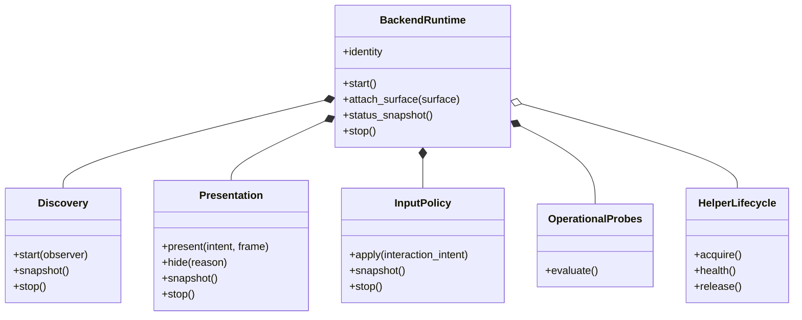

# Backend Contracts and Control-Plane Schema

## Gap analysis

The current `BackendBundle` names the right broad components but exposes mostly factories and identity:

- discovery only creates a tracker;
- presentation only creates an integration;
- input policy has no behavioral operations;
- helper IPC exposes only helper kind;
- capabilities are nominal booleans rather than probe evidence;
- status collapses support and runtime classification into `true_overlay`, `degraded_overlay`, or `unsupported`;
- `backend.consumers` still detects GNOME identities and imports private GNOME presentation code.

The converged contracts must express behavior and ownership without defining GNOME renderer names, D-Bus payloads, target tokens, or transition actions in generic modules.

## Recommended contract partition

One concrete object may implement presentation and input, but consumers receive separate interfaces. Helper lifecycle is optional and backend-private implementations translate to generic state. Capture remains capability vocabulary only; no behavioral capture contract is added.

## Intent and result models

Generic presentation intent should describe requested mode, target/monitor geometry in normalized coordinate spaces, visibility, frame availability, and interaction intent. It must not name `managed_pyqt`, `gnome_shell_raster`, GNOME Overview, or a helper action. Backend status may expose an opaque presenter label for diagnostics, but generic control flow never dispatches on it.

Every behavioral call returns an explicit result with:

- outcome (`applied`, `pending`, `hidden`, `unavailable`, `rejected`);
- normalized reason code;
- health impact and recovery class;
- optional sanitized backend diagnostics;
- current state revision for correlation.

## Three-dimensional status model

Status must keep these independent:

1. **Support policy**: supported, compatibility, unvalidated-operational, unimplemented, unsupported.
2. **Validation evidence**: the seven settled evidence levels plus environment/mode key and last-reviewed release.
3. **Runtime health**: constructing, healthy, degraded, unavailable, incompatible, ownership-conflict, stopping, stopped.

Add active presenter/transition state, probe evidence, restart requirement, normalized failures, and lifecycle/ownership summaries as separate fields. A supported backend with a missing helper remains supported but currently unavailable.

## Schema recommendation

Use one explicitly versioned backend control-plane envelope shared by plugin, client, controller, preferences UI, collector, and tests. Backend settings and this envelope may break compatibility per Question 22; overlay content payloads remain unchanged.

Conceptual top-level fields:

- `schema_version` and producer/version;
- selected runtime identity and immutable selection inputs;
- support policy and validation evidence;
- operational probe results with normalized capability IDs and backend-private sanitized evidence;
- runtime health, restart requirement, and recent failure records;
- active presentation/input summaries;
- helper compatibility and ownership summary where applicable;
- lifecycle timestamps/revisions and diagnostic correlation IDs.

Unknown schema versions fail safely and render a clear incompatibility message. Settings use a separate version so a stale backend override can be reset without invalidating runtime status.

## Selection and placeholders

- GNOME native Wayland constructs only when its operational helper prerequisite passes.
- native X11 selects on X11 capabilities; Mutter is validation metadata and an optional narrow policy, not a backend identity.
- XWayland remains a distinct compatibility runtime.
- detected KWin/wlroots/Hyprland/generic/COSMIC/gamescope environments resolve to registered unimplemented descriptors, not the shared transitional Wayland integration.

## Boundary enforcement

Architecture tests should scan generic launcher, follow, lifecycle, selector/status, and control-plane modules for private backend imports and forbidden compositor enums. Registration may name backend factories in one composition registry; generic consumers must not.
