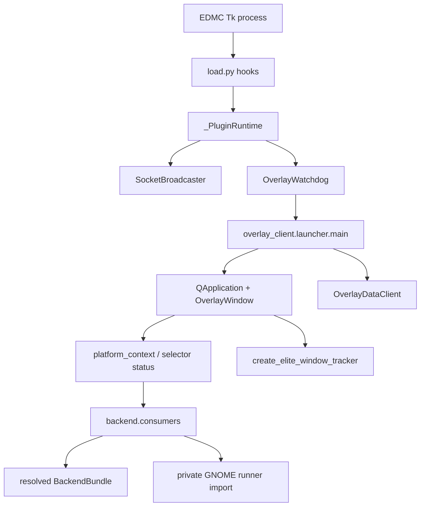
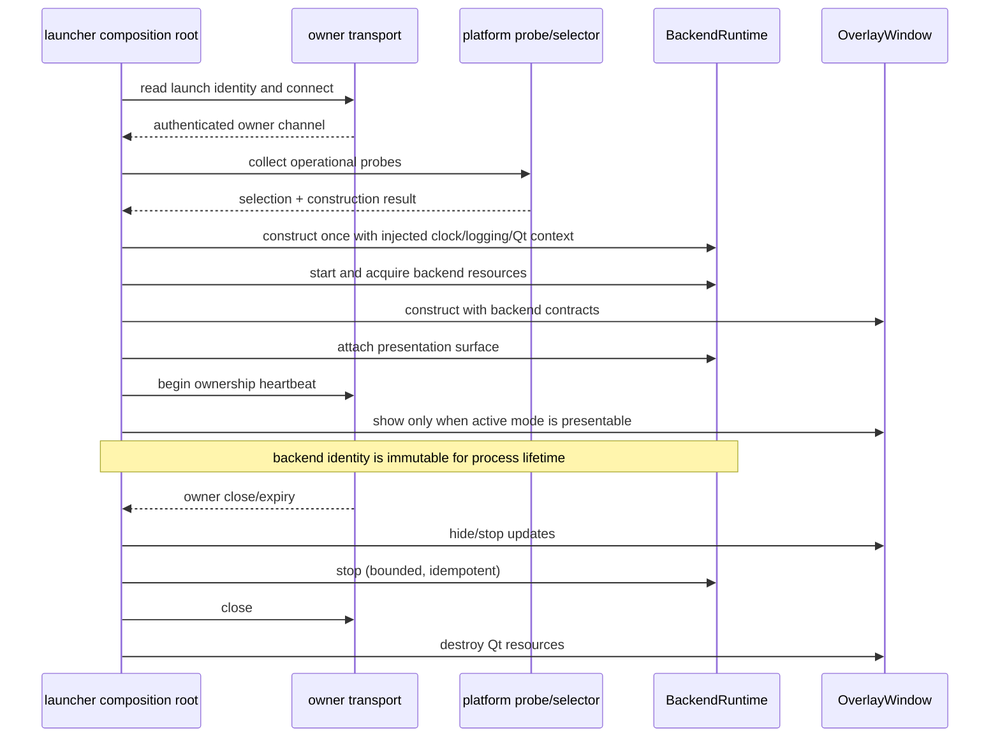

# Composition Root and Runtime Ownership

## Finding

The overlay-client launcher is the correct production composition root. It already owns `QApplication`, `OverlayWindow`, `OverlayDataClient`, target-tracker construction, startup ordering, and final shutdown. It should construct exactly one selected `BackendRuntime` after Qt and initial settings are available but before the overlay is shown.

`load.py` is not a viable backend composition root: it runs inside EDMC, may not have PyQt/runtime dependencies, observes only a launch-time platform hint, and must remain backend-neutral. `OverlayWindow` is also too narrow: it should consume runtime services, not own process-level helper acquisition and teardown.

## Current construction and ownership

Current behavior is distributed rather than rooted:

- `load.py:_PluginRuntime.start()` starts the TCP broadcaster and watchdog, then directly clears GNOME Shell raster state.
- `overlay_client.launcher.main()` constructs the Qt window and data client, then separately creates the tracker and separately performs GNOME startup/shutdown cleanup.
- `OverlayWindow.current_backend_status()` constructs runtime status from platform context.
- tracker, integration, focus flags, and presentation cycles resolve through separate consumer helpers; no single object owns their shared lifetime.
- `backend.consumers.run_backend_presentation_cycle()` dispatches on GNOME backend/helper enums and lazily imports the GNOME implementation.

## Recommended production construction sequence

The design should permit construction failure to return a normalized unavailable status before exiting or remaining hidden. For GNOME native Wayland, missing/incompatible helper at construction is restart-required; transient loss after acquisition is recoverable within the same runtime.

## Proposed ownership API shape

The detailed design should specify a small process-lifetime object, conceptually:

- immutable identity, support policy, and validation-evidence reference;
- `start()`, `attach_surface(...)`, `status_snapshot()`, and idempotent `stop()`;
- discovery, presentation, and input behavioral consumers;
- optional backend-private helper lifecycle;
- backend-generated diagnostics and health events.

The runtime owns component state and ordering. Generic code must not fetch a bundle repeatedly or reconstruct components when target, monitor, mode, scale, helper health, or presenter changes.

## Migration implications

1. Lift existing selection and bundle construction into a client composition object without changing presentation behavior.
2. Route tracker and integration creation through the one runtime.
3. Lift the existing GNOME state machine intact behind runtime presentation/helper contracts.
4. Move startup recovery and cleanup from both `load.py` and the launcher into GNOME runtime ownership.
5. Retain the old dispatch path only behind the agreed developer rollback toggle.
6. Remove `backend.consumers` enum dispatch, launcher private GNOME imports, `load.py` private cleanup, and the obsolete raster backend identity after parity validation.

## Risks

- Qt platform information is reliable only in the client after `QApplication` exists; probing too early may recreate the current plugin-hint/runtime split.
- Construction must not show the window before the selected runtime determines whether the current mode is presentable.
- Moving ownership and rewriting the Phase 19 transition machine in one step would combine two high-risk changes; use lift-then-prove staging.
