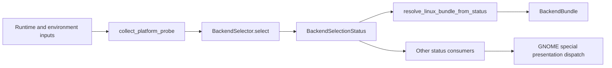
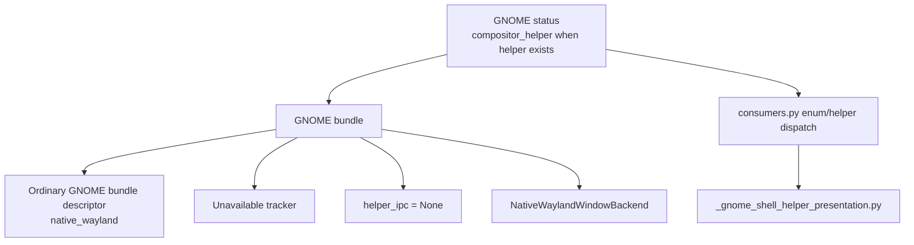
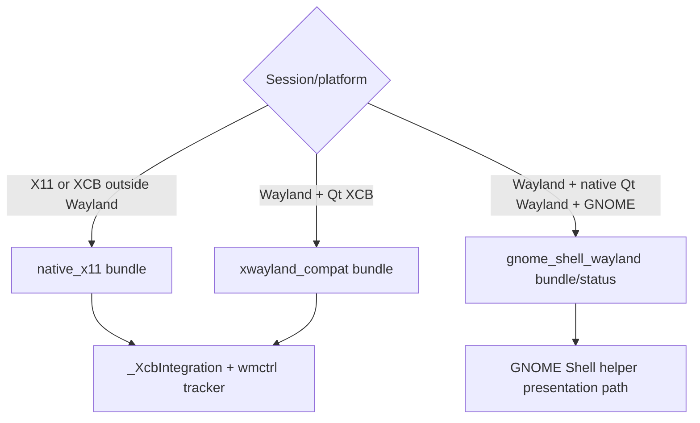

# Current Architecture and Ownership

## Scope and Method

This note verifies the current `fix219` implementation against repository source, tests, planning records, and recent Git history. It treats `/tmp/handoff-20260717-135402.md` as an index, not as proof.

Repository state at the start of research:

- Branch: `backend-refactor-implementation`
- HEAD: `5f99fc0` (`fix(gnome): implement Phase 19 atomic fullscreen monitor handoff`)
- Existing tracked worktree was clean; this PDD project is the only untracked tree.

## Implemented Selection Flow

The client-owned selector is authoritative and produces a status containing probe evidence, backend identity, support classification, helper state, fallback context, and diagnostics. Linux status is then mapped to a concrete bundle by backend instance.

The last edge is the central architectural gap: status is also consumed directly to select GNOME-specific presentation behavior instead of all behavior being reached through the resolved bundle.

## Current Contracts

`overlay_client/backend/contracts.py` defines:

- `PlatformProbe`
- `TargetDiscoveryBackend`
- `PresentationBackend`
- `InputPolicyBackend`
- `HelperIpcBackend`
- `BackendBundle`

The contracts provide useful identity and construction seams, but behavior ownership is uneven:

| Contract | Current behavioral surface | Finding |
| --- | --- | --- |
| `TargetDiscoveryBackend` | Creates a tracker | Behavioral, though GNOME declares no tracker |
| `PresentationBackend` | Creates a platform integration | Too narrow for GNOME helper presentation cycles and lifecycle |
| `InputPolicyBackend` | Backend identity only | Declarative rather than behavioral |
| `HelperIpcBackend` | Backend/helper identity only | Declarative rather than transport/lifecycle-owning |
| Capture policy | Absent | Original research contract has not landed |

`BackendCapabilities` currently expresses platform label, native-Wayland windowing, transient-parent use, tracker availability, and tracker fallbacks. It does not express the full behavioral capability set required to prove a supported overlay.

## Capability Evidence Gap

`PlatformProbeResult` can carry `available_protocols`, and exposes `has_protocol()`. Runtime code does not populate protocol evidence and selector code never calls `has_protocol()`. Protocol fields are exercised only by contract/probe tests.

The selector is therefore session/compositor/helper driven:

- X11 session or XCB platform selects `native_x11`.
- Wayland plus XCB selects `xwayland_compat`.
- Native Wayland selection branches on compositor name.
- Unknown native Wayland selects `wayland_layer_shell_generic`.

Classification is similarly identity-based. Except for COSMIC/gamescope, XWayland compatibility, and GNOME, other selected identities receive `true_overlay` without proving presentation, discovery, input, or protocol requirements.

## Bundle Identity Versus Runtime Identity

For ordinary `GNOME_SHELL_WAYLAND`, a healthy helper can cause status family `compositor_helper`, while the bundle builder still returns a `native_wayland` descriptor with no helper component. The executing GNOME helper behavior is selected outside the bundle.

Other identity mismatches also exist:

- COSMIC and gamescope status instances map to the generic layer-shell bundle.
- Native Wayland identities share `NativeWaylandWindowBackend` and `_WaylandIntegration`.
- `_WaylandIntegration` branches internally on compositor names for layer-shell, KWin, and GNOME behavior.

Tests explicitly preserve this transitional shape, including shared presentation/input objects and a shared `_WaylandIntegration` class.

## X11, XWayland, and GNOME

GNOME on a native X11 desktop session is currently handled by the generic native X11 backend; compositor identity does not alter that selection. GNOME on native Wayland is the dedicated helper-backed path. XWayland compatibility is a third, explicitly degraded path and must not be conflated with native GNOME/X11 support.

The project must decide whether “GNOME X11 supported” means validating the existing generic native X11 backend under GNOME/Mutter, rather than creating a GNOME-specific X11 bundle. Current evidence favors validation first and specialization only if behavior demands it.

## Architectural Design Inputs

1. Create one runtime composition root that owns probe, selection, bundle construction, lifecycle, and diagnostics.
2. Make selected status and constructed runtime identity impossible to disagree.
3. Replace consumer-level GNOME enum/helper dispatch with behavior reached through a backend-owned runtime object.
4. Expand contracts around behavior, not compositor identity.
5. Keep generic interfaces free of GNOME concepts so KDE/KWin can implement them later.
6. Preserve native X11 and XWayland as separate identities even when they reuse implementation mechanisms.

