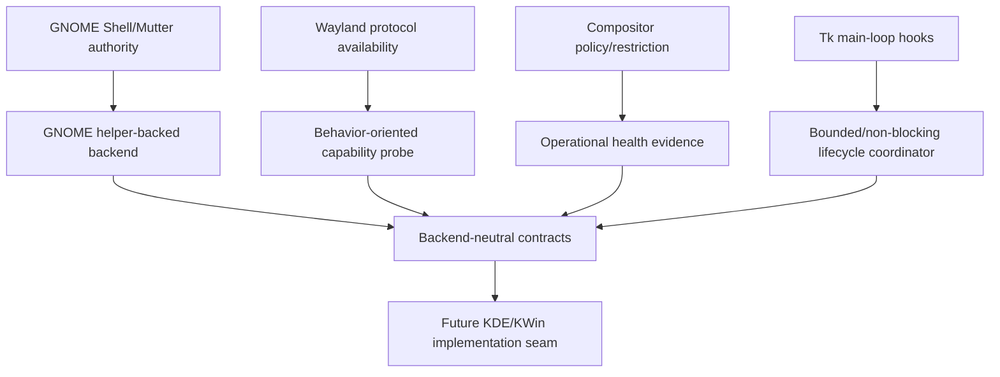

# External Platform Constraints

## GNOME Shell as the GNOME Integration Boundary

GNOME's extension architecture documents that Mutter is the Wayland compositor in Wayland sessions and the window/compositing manager in X11 sessions. Extensions have access to displays, workspaces, and windows through Mutter's `Meta` API and become part of GNOME Shell when enabled. This supports a compositor-helper backend for GNOME/Wayland and explains why equivalent authority is unavailable to a normal Wayland client.

Source: [GNOME JavaScript extension architecture](https://gjs.guide/extensions/overview/architecture.html)

GNOME also documents that extensions do not have a fully stable dedicated API and must declare/test supported Shell versions. The design therefore needs explicit helper protocol versioning, Shell-version compatibility evidence, health diagnostics, and graceful degradation.

Source: [GNOME extension updates and breakage](https://gjs.guide/extensions/overview/updates-and-breakage.html)

## Wayland Capability Evidence

The staging `ext-foreign-toplevel-list-v1` protocol provides foreign toplevel identities and basic properties, but it is intentionally minimal and compositor policy may restrict it to a privileged/special client. It does not by itself prove geometry, presentation, or input control. Therefore, “protocol advertised” and “backend operational” must be distinct evidence states.

Source: [ext-foreign-toplevel-list-v1 protocol](https://wayland.app/protocols/ext-foreign-toplevel-list-v1)

This supports modeling capabilities by behavior:

- target discovery
- target geometry/state
- presentation/stacking
- input/focus policy
- helper transport health
- capture policy

A backend should claim support only when the full required set is operational for its declared mode.

## EDMC Runtime Constraints

EDMC's plugin documentation states that plugin hooks run on the Tk main loop and long-running/network-bound work should not block it. That makes synchronous GNOME DBus cleanup in plugin startup/shutdown an architectural and compliance concern, not merely an implementation preference.

Sources: [EDMC plugin documentation](https://github.com/EDCD/EDMarketConnector/blob/main/PLUGINS.md), [EDMC release documentation](https://github.com/EDCD/EDMarketConnector/blob/main/docs/Releasing.md)

Formal EDMC compliance and version-baseline remediation belong to the separate closure/signoff track, but the architecture design must not introduce additional unsupported imports or blocking hook work.

## Consequences for This Project

The project should implement GNOME and native X11 support while using behavior-oriented contracts that a future KDE/KWin backend can satisfy independently. It should not encode GNOME Shell concepts, DBus method names, raster modes, or transition states into the generic backend interfaces.

