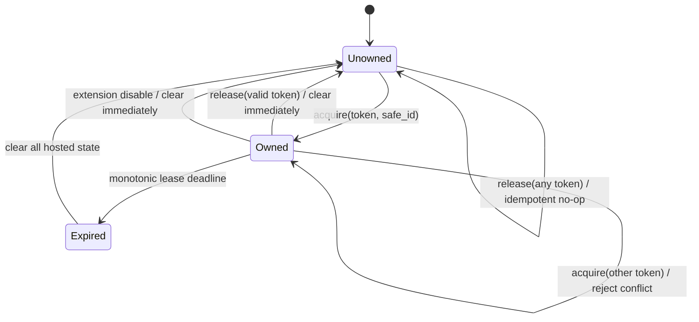

# GNOME Helper Ownership and Lease Protocol

## Current helper protocol

The extension exports protocol 3 with `Hello`, `GetHealth`, `GetTargetState`, and `ApplyPresentation`. Requests carry no client identity or lease. Any caller can mutate presentation state, and a newer caller is not rejected as a competing owner.

The extension owns its well-known D-Bus name with `Gio.BusNameOwnerFlags.REPLACE`, exports one service object, and clears Shell actors only on explicit clear paths or extension `disable()`. GNOME requires everything established by `enable()` to be undone by `disable()`, which the current actor/signal cleanup generally follows. GIO also provides name-loss callbacks, but losing the extension service name only describes the extension's own service lifecycle; it does not prove a particular overlay client is alive.

## Protocol recommendation

Use one coordinated protocol bump after the composition lift. Keep GNOME concepts private to the GNOME runtime and extension.

### Required methods

The exact D-Bus method names may be chosen in design, but semantics should include:

- acquire presentation ownership;
- renew the active lease;
- release ownership idempotently;
- query sanitized ownership/health state;
- apply presentation only under a valid active lease.

Acquisition supplies an unguessable owner token plus a separate safe correlation ID. The secret token is compared exactly but never returned or logged. The safe ID may be a short random instance label with no PID, username, command line, or path.

### State machine

Initial renewal cadence is 2 seconds and expiry approximately 10 seconds. The extension must schedule its own GLib timeout against monotonic time; expiry cannot depend on another client request arriving. All Shell raster actors, regions, target attachment/suppression, renderer ownership, cached presentation identity, and transition state must clear as one idempotent operation.

### Conflict and restart behavior

- A healthy owner cannot be preempted. A second token receives an explicit `ownership_conflict` result without details that identify the owner.
- A new EDMC/client instance waits until normal release or expiry; it does not adopt the old lease.
- A valid owner may safely repeat acquire/renew/release operations to tolerate lost responses.
- Invalid/missing tokens fail closed and cannot query sensitive ownership material.
- Startup recovery clears legacy protocol-3 state once before acquiring the new lease. After the coordinated bump ships, no dual-protocol operation is required.

## D-Bus service-name behavior

The extension itself should not request replacement semantics unless there is a demonstrated reason. `NONE` (or a non-preemptive ownership policy) better matches the requirement that a healthy service not be replaced, while name-loss must unexport and clear hosted state. This service-name policy is separate from overlay-client presentation ownership.

## Failure mapping

Private GNOME results should normalize at the runtime boundary:

| GNOME condition | Generic health/failure |
|---|---|
| service missing at construction | unavailable, restart required |
| protocol mismatch | incompatible, restart required |
| competing healthy token | ownership conflict, retry/wait |
| transient D-Bus call failure after acquisition | degraded, live recovery allowed |
| lease renewal deadline missed | ownership lost, overlay hidden |
| extension disabled/name lost | helper unavailable, hosted state cleared |
| presentation request rejected for token | ownership lost or protocol error |

## Required tests

- source/manifest tests for the coordinated protocol bump and Shell 46–50 metadata;
- pure state-machine tests with an injected monotonic clock;
- GJS or isolated D-Bus tests for acquire/renew/release/conflict/expiry and secret redaction;
- client tests ensuring every mutating presentation request is lease-authorized;
- crash tests showing actors expire without client cleanup;
- extension disable/re-enable, Shell restart, screen lock/unlock, and GNOME Overview manual tests.

## Sources

- [GNOME extension lifecycle](https://gjs.guide/extensions/overview/anatomy.html)
- [GIO `bus_own_name`](https://docs.gtk.org/gio/func.bus_own_name.html)
- [GIO bus-name flags](https://docs.gtk.org/gio/flags.BusNameOwnerFlags.html)
