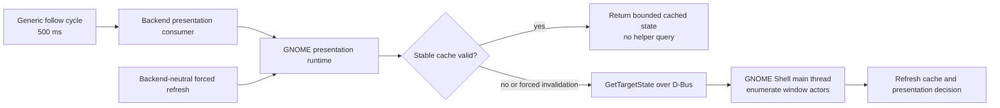

# GNOME Helper Pressure and Unchanged Repaint Research

## Status and source

Completed as a focused Step 3 planning amendment on 2026-07-21. The primary source is
`/tmp/handoff-20260721-062740.md`, which records the active evidence state, observed desktop
incident, relevant code seams, and user-approved next objective. This note preserves those
findings as project context; it does not authorize implementation.

The Firefox/GNOME failure is not attributed to the overlay. The observed Mutter assertions
match a Firefox native-Wayland drag-and-drop failure family, while the overlay/helper remains a
plausible load amplifier. The safe engineering response is to reduce unnecessary Shell-main-
thread work and measure it without attempting to reproduce the failure.

## Evidence snapshot

| Observation | Recorded evidence | Planning implication |
| --- | --- | --- |
| Reduced-v2 matrix | 12 of 42 captures accepted; privacy scans empty; all manual invariant fields false | Preserve as historical pre-optimization evidence |
| Stable target queries | 3,601 `target_query_started` events in 30 minutes, exactly two per second | Existing stable-query suppression is ineffective in the observed mode |
| Repaint requests | Approximately 816–841 per 30-second observation | Separate request, Qt paint, and Shell-raster work before changing behavior |
| Actual paint/raster work | Managed paints approximately 23–50; Shell-raster scenarios often built one frame | Request volume cannot be treated as equivalent to visible repaint cost |
| Host load sample | GNOME Shell averaged 38.8% CPU over five seconds with full helper diagnostics active | Turn diagnostics off and use repeated controlled samples before conclusions |
| Presentation state | No presentation churn, helper errors, or live Shell actors in the final stable-windowed sample | Optimize steady no-op paths without weakening transition/recovery contracts |

The sample was collected during an incident and is diagnostic evidence, not a baseline or an
acceptance threshold. Raw process IDs, command lines, target handles, titles, and personal paths
remain outside committed evidence.

## Current code-path finding

Generic follow runs every 500 ms. The GNOME presentation implementation already defines a
1.5-second suppressed-target poll interval plus cached request, target, and status state. Its
early-skip condition is disabled while the transition guard is enabled; that guard is normally
active with Shell-raster support. This is the leading code-level explanation for the observed
two synchronous `GetTargetState` calls per second and must be captured in a failing unit test
before behavior changes.

The extension's `GetTargetState()` runs synchronously on the GNOME Shell main thread and
enumerates `global.get_window_actors()` to construct window payloads. Avoiding unchanged calls
therefore removes work from a latency-sensitive compositor thread.

The generic layer may request a presentation refresh but cannot name GNOME, helper modes,
presenters, or private enums. Cache policy, invalidation, and helper calls remain backend-owned.

## Stable-target cache contract

- Use explicit state and an injected monotonic clock.
- A stable matching target and presentation reuse cached state until a bounded deadline.
- The active transition guard cannot by itself disable steady-state suppression.
- Presentation refresh, failed/unavailable results, target loss/recovery, managed/Shell mode
  transitions, stale raster leases, and changes to focus, monitor, geometry, workspace,
  minimized state, or fullscreen state can force immediate work as appropriate.
- Recovery is never hidden behind a long stable-cache interval.
- The cold-start deferred-remap refresh bypasses matching-success and mismatch suppression
  exactly once, then returns to steady no-op behavior.
- Stable polling intervals are provisional until the A/B evidence is reviewed.
- Normal diagnostics emit state changes/errors plus bounded aggregate heartbeats, never one
  journal record for each unchanged stable query.

Primary tests belong in
`overlay_client/tests/test_gnome_helper_presentation_runtime.py`. They cover steady cycles,
deadline expiry, transition-guard interaction, forced refresh, errors and recovery, focus,
monitor, fullscreen, geometry/workspace/minimize changes, stale raster state, and the post-remap
one-shot refresh contract. These are unit tests because clock and helper dependencies can be
injected without EDMC lifecycle wiring.

## Repaint contract

Existing payload deduplication already compares visual snapshots and can refresh TTL without
repainting identical supported payloads. Implementation must first identify which path produces
the stable-run requests rather than add an overlapping dedupe system.

- Identical rendered output may refresh TTL or stored metadata without scheduling Qt update,
  rebuilding a frame, or refreshing backend presentation.
- Content, geometry, style, group, override, expiry/removal, animation, short-lived payload,
  scale, mode/monitor, visibility/exposure recovery, and explicit presentation-refresh changes
  still repaint when required.
- Request suppression, Qt `update()`/paint suppression, and Shell raster build/reuse are separate
  measurements and contracts.
- The dedupe boundary should prevent known no-op scheduling before `paintEvent`; unrecognized
  payload types retain a safe repaint fallback.
- Any extended visual fingerprint is pure, deterministic, and exhaustively unit tested.
- Diagnostics remain developer-gated and aggregated so measurement does not recreate the load.

Likely test seams are `test_payload_dedupe.py` and `test_repaint_debounce.py`, with production
touchpoints selected only after bounded per-reason evidence identifies the smallest correct
boundary.

## Controlled A/B design

The first experiment uses stable windowed Elite on monitor A at 100%, with Firefox stopped.
Payload fixture, display scale, monitor, refresh rate, game mode, warm-up, and sample length stay
identical.

| Cell | Overlay client | GNOME helper extension |
| --- | --- | --- |
| A1 | Stopped | Disabled |
| A2 | Running in documented unavailable/fallback state | Disabled |
| B1 | Stopped | Enabled, full helper, diagnostics off |
| B2 | Running | Enabled, full helper, diagnostics off |

Each cell receives a five-minute warm-up and three 60-second samples. Enabled and disabled order
is interleaved where practical. Record allowlisted aggregate CPU, context switches, RSS, bounded
GPU utilization/VRAM, target queries, presentation calls, repaint requests, Qt paints, raster
build/reuse/skip, actor counts, and relevant warning/assertion counts. Summaries report median
plus p95 or range; a favorable singleton is never the gate.

The A/B must distinguish enabled-but-idle extension cost from the client's incremental stable
query cost. Pressure-reduction acceptance bounds are reviewed from the quiet repeated
measurements, not selected in advance. They belong to the A/B report and do not populate the
versioned `thresholds.json` used for later migration comparisons.

Visible flashing, input loss, drag-feedback corruption, repeated Mutter assertions, or rapidly
rising Shell CPU stops the run immediately. Firefox failure reproduction is not an acceptance
test.

## Evidence and sequencing decision

1. Preserve the 12 accepted reduced-v2 captures and two superseded full-oracle captures.
2. Disable diagnostics before ordinary use or measurement.
3. Implement query and repaint pressure reduction test-first.
4. Pass the controlled A/B and manual behavior/quiet-soak gates.
5. Create a new post-optimization manifest/evidence identity.
6. Restart the 14-scenario by three-repetition baseline at 0/42.
7. Freeze reviewed migration-regression thresholds only after the coherent baseline is complete.

The old and new captures must never be combined into one threshold population. Step 3 and all
later production-routing steps remain gated until the clean baseline and its manual review are
complete.

## References

- `/tmp/handoff-20260721-062740.md`
- `performance-baseline.md`
- `../../../refactoring/gnome_wayland_presentation_attachment.md`
- <https://github.com/SweetJonnySauce/EDMCModernOverlay/issues/247>
- <https://github.com/SweetJonnySauce/EDMCModernOverlay/issues/251>
- <https://bugzilla.mozilla.org/show_bug.cgi?id=2022238>
- <https://bugzilla.mozilla.org/show_bug.cgi?id=2001075>
- <https://bugzilla.mozilla.org/show_bug.cgi?id=2033108>
- <https://bugzilla.mozilla.org/show_bug.cgi?id=1979719>
- <https://gitlab.gnome.org/GNOME/mutter/-/issues/740>
