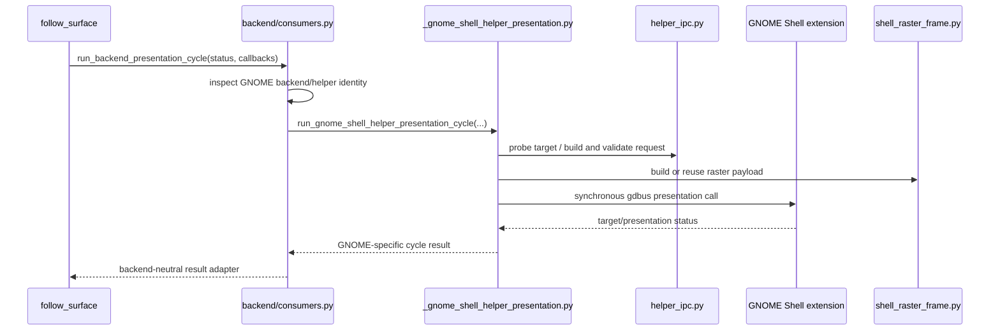
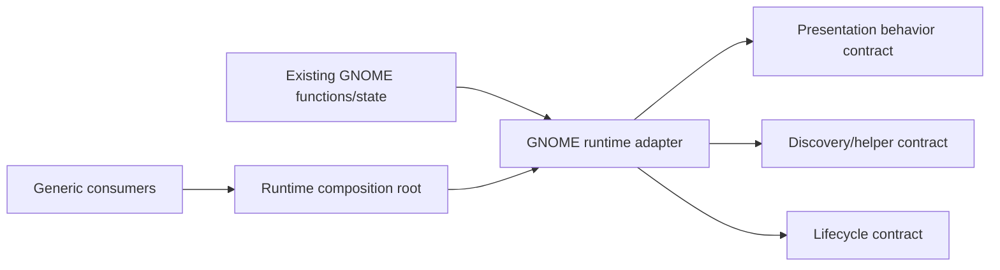

# GNOME Runtime and Lifecycle Ownership

## Current Runtime Path

GNOME/Wayland behavior is functionally advanced but structurally split across generic and private modules.

`follow_surface.py` is correctly insulated from GNOME helper enums and private presentation imports. The insulation is achieved by moving special dispatch into `backend/consumers.py`, not yet by making the GNOME bundle own that behavior.

## Lifecycle Leaks

Both `overlay_client/launcher.py` and `load.py` import the private GNOME presentation implementation to clear Shell raster state at startup/shutdown. The cleanup function ultimately uses synchronous `subprocess.run` with `gdbus`.

Consequences:

- Generic lifecycle code knows a private compositor implementation.
- Cleanup depends on settings/environment checks duplicated outside the selected runtime.
- Plugin startup and shutdown may block EDMC's Tk hook path.
- Backend cleanup cannot be managed uniformly or tested through one lifecycle contract.

A backend-neutral runtime lifecycle should own startup recovery, presentation cleanup, and close behavior. EDMC hook wiring should invoke an asynchronous or bounded coordinator rather than GNOME DBus directly.

## Phase 19 Invariants to Preserve

Phase 19 completed a narrowly scoped atomic fullscreen monitor-handoff fix. The convergence work must preserve these invariants:

- A single transient `fullscreen=false` sample cannot immediately transfer renderer ownership when the same target is undergoing a monitor/geometry transition.
- The transition grace period is named and injectable; the validated default is 1.5 seconds.
- A return to fullscreen within the bound settles directly to Shell raster.
- Persistent windowed state commits exactly once to the managed PyQt path.
- Shell-raster-to-managed transition prepares a content-suppressed, focus-safe surface and confirms geometry before cleanup/reveal.
- Managed-to-Shell-raster transition proves raster attachment before hiding/resetting the Qt surface.
- No simultaneous visible Shell-raster and managed-PyQt presenters.
- The rollback toggle remains available while migration risk exists.
- Stable managed-window behavior and deferred standalone/task-list identity are not silently redefined by architecture work.

## Safe Migration Seam

The safest migration is to lift the current implementation intact behind a GNOME-owned object before decomposing it:

Initial extraction should delegate to existing functions and preserve toggles, state, timing, request schemas, and diagnostics. Only after contract and lifecycle tests prove parity should the large modules be split by responsibility.

## Complexity Concentration

Current approximate sizes:

| Module | Lines |
| --- | ---: |
| `backend/helper_ipc.py` | 2,342 |
| `backend/bundles/_gnome_shell_helper_presentation.py` | 2,090 |
| `backend/shell_raster_frame.py` | 1,687 |
| `backend/consumers.py` | 498 |

Likely later decomposition boundaries include helper transport, target discovery snapshots, presentation policy/state, transition arbitration, raster production/ownership, and lifecycle cleanup. File splitting is not the first step because it would not by itself correct ownership.

## GNOME X11 Implication

GNOME extensions operate within GNOME Shell in both Wayland and X11 sessions, but the current repository uses the extension-backed presentation mechanism only for GNOME/Wayland. Native X11 already provides a separate window-management/tracking path.

The project should not automatically force GNOME/X11 through the Wayland helper presentation pipeline. It should validate native X11 under GNOME/Mutter against the support checklist and introduce GNOME-X11 specialization only for proven gaps.

