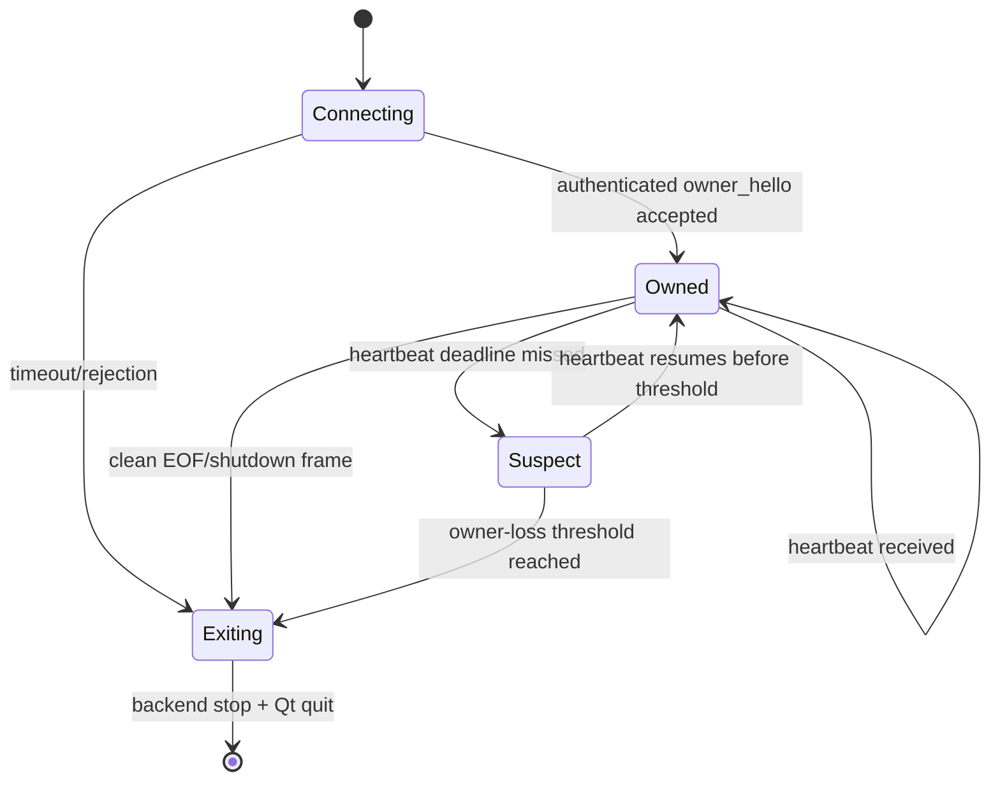

# EDMC-to-Client Ownership and Liveness Transport

## Current transport behavior

The plugin starts a loopback JSON-lines TCP server, writes its ephemeral port to `port.json`, and launches the client under `OverlayWatchdog`. The connection is bidirectional: plugin broadcasts flow server-to-client and client CLI/status payloads flow client-to-server.

The connection is not currently an ownership protocol:

- `port.json` contains port, version, and log-level data, but no launch or owner identity.
- the server accepts multiple loopback clients without authentication or roles;
- the client treats EOF as a recoverable disconnection and retries with a 1–10 second backoff;
- no owner heartbeat exists;
- `OverlayWatchdog` polls the child about once per second and forcibly terminates it during normal plugin shutdown;
- a restarted EDMC instance can overwrite `port.json` while an old client continues attempting to reconnect.

Python documents that an empty `StreamReader.readline()` result means EOF, so orderly server closure is already directly observable. `time.monotonic()` is appropriate for elapsed deadlines because it cannot move backwards when the wall clock changes.

## Recommended protocol

Promote the single watchdog-launched client connection to an authenticated owner channel while preserving the same loopback TCP transport.

### Launch record

Write an atomic, versioned launch record containing:

- transport schema version;
- port;
- cryptographically random launch token;
- opaque EDMC owner instance ID;
- expected client role and plugin version;
- heartbeat interval and owner-loss threshold.

The token is capability material and must never appear in logs, status, diagnostics, or community reports. Restrict file permissions where the platform permits. Replace the record atomically so the client never observes partially written JSON.

### Handshake and role

The launched client must send a bounded-time `owner_hello` carrying the launch token and a fresh opaque client instance ID. The server binds one connection to the owner role. Unauthenticated connections may retain narrowly scoped controller/CLI behavior only if explicitly separated; they must not renew ownership or receive ownership secrets.

### Liveness rules

- Clean EOF or an explicit server shutdown frame starts immediate client shutdown; it does not enter reconnect backoff.
- The plugin sends an owner heartbeat every 2 seconds on the owner connection.
- The client records receipt using a monotonic clock and begins shutdown after the configured missed-heartbeat threshold (initially about 6 seconds).
- The persistent stream remains the primary signal. Heartbeats cover half-open/stalled cases, not ordinary closure.
- The client never reconnects as the same ownership instance. A new EDMC launch creates a new client identity.
- Backend lease renewal is driven only while the owner channel is healthy; owner loss first stops renewals and then runs bounded backend cleanup.

## Suspend, stalls, and debugger behavior

The initial 2-second/6-second values should remain configuration supplied by the owner protocol and injected in tests. A monotonic clock prevents wall-clock corrections but suspend behavior differs by platform/clock implementation, so acceptance tests must explicitly cover resume.

Recommended policy:

- if both endpoints were suspended and the stream remains valid, accept a fresh heartbeat before acting only when the event loop can observe it within the same scheduling turn;
- do not silently grant an unbounded grace period after a true owner loss;
- allow a developer-only liveness pause/expanded threshold for debugger sessions rather than weakening release behavior;
- record normalized `owner_eof`, `owner_heartbeat_expired`, `owner_handshake_rejected`, and `owner_shutdown_requested` events.

## Server and watchdog integration

The broadcaster should expose connection lifecycle callbacks and a dedicated owner session instead of leaking its `_clients` set. Normal stop order becomes: publish shutdown intent, close/await the owner channel briefly, allow client/backend cleanup, then use watchdog terminate/kill only as a bounded escape hatch. Abrupt EDMC death remains covered by EOF or heartbeat expiration.

## Required tests

- unit tests for handshake, token rejection, heartbeat deadlines, monotonic timing, idempotent owner-loss transition, and secret redaction;
- transport tests for clean EOF, half-open/no-heartbeat, malformed frames, multiple clients, backpressure, and reconnect prohibition;
- harness tests for plugin start/stop ordering, port-record lifecycle, EDMC restart/new identity, and watchdog escalation;
- manual suspend/resume and debugger-pause probes before final timing is fixed.
