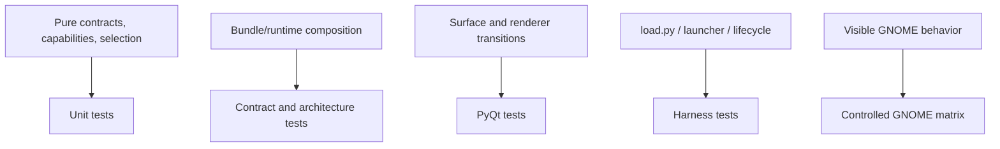

# Tests, Invariants, and Migration Risks

## Existing Coverage

The repository has broad backend/GNOME test coverage. Relevant categories include:

- Pure probe and selector tests.
- Bundle contract tests for X11, XWayland, and named Wayland identities.
- Consumer adapter/presentation-cycle tests.
- GNOME helper IPC schema and validation tests.
- GNOME target, presentation state, runtime, extension-source, DBus-health, transition, and raster tests.
- PyQt follow-surface and presentation-policy tests.
- Launcher raster cleanup tests.
- EDMC harness tests for selection/status/override wiring.

The inspected backend/GNOME test files contain hundreds of individual tests. The last recorded Phase 19 GUI-enabled result was `1169 passed, 21 skipped, 1 deselected`, but it was not rerun during this read-only research pass.

## What Current Tests Lock In

Several tests intentionally preserve transitional architecture:

- All native Wayland bundles share one `_WaylandIntegration` implementation.
- Presentation and input policy use the same combined object.
- GNOME and generic Wayland bundles may expose no tracker.
- GNOME presentation is special-dispatched by `backend/consumers.py`.
- The architecture boundary test protects only `follow_surface.py` from GNOME imports/enum dispatch.

These are useful regression anchors for the completed refactor, but some must be deliberately superseded as contract ownership improves.

## Required Test Strategy for Convergence

Each implementation increment should carry its tests, not defer testing to a final phase.

New architectural tests should prove:

1. Generic runtime, launcher, and plugin lifecycle modules do not import private compositor presentation implementations.
2. A selection result constructs exactly one matching runtime identity.
3. Capability classification requires evidence for the behaviors it claims.
4. GNOME helper behavior is reached through GNOME-owned contracts.
5. Lifecycle cleanup is idempotent, bounded/non-blocking at EDMC hooks, and backend-neutral.
6. Phase 19 renderer ownership and handoff invariants remain unchanged.
7. Unknown or incomplete Wayland capability sets cannot receive unsupported `true_overlay` claims.
8. Native X11, XWayland compatibility, and GNOME native Wayland remain distinct support identities.

## Support Validation Matrix

The definition of “supported” must reuse the original true-overlay checklist: visibility, basic tracking, display matrix, mode changes, input policy, presentation, stability, supportability, and absence of undefined hacks.

For this project, validation scope should include:

| Environment | Architectural identity | Expected project outcome |
| --- | --- | --- |
| GNOME native Wayland | GNOME helper-backed runtime | Supported after automated and manual matrix closure |
| GNOME native X11 | Native X11 runtime under Mutter | Supported after environment-specific validation |
| GNOME Wayland + Qt XCB | XWayland compatibility | Explicitly separate/degraded unless requirements change |
| KDE/KWin and others | Future implementations | Interfaces reviewed for extensibility only; no support claim |

Exact GNOME versions, distributions, display layouts, scaling combinations, and supported Elite display modes remain requirements questions.

## Major Risks

- Refactoring the GNOME state machine while changing ownership could regress manually proven behavior.
- A broad runtime-context abstraction could become a service locator rather than a clear composition root.
- Capability metadata could remain declarative unless selection consumes real probe evidence.
- Supporting GNOME/X11 may be overstated if it is inferred from generic X11 tests instead of manually validated under Mutter.
- Synchronous DBus cleanup can block Tk lifecycle hooks.
- Extension APIs can change across GNOME releases; compatibility must be version-tested and failures diagnosable.
- Designing concrete KDE behavior now would expand scope; failing to review interface neutrality would recreate GNOME coupling.

## Reversibility Requirements

- Lift existing GNOME functions behind adapters before rewriting them.
- Preserve the Phase 19 rollback toggle through ownership migration.
- Keep old and new composition paths selectable in development until parity is demonstrated.
- Land changes in behavior-scoped increments with unit/harness/manual evidence per touchpoint.
- Do not remove compatibility paths until the replacement has passed the relevant environment matrix.

