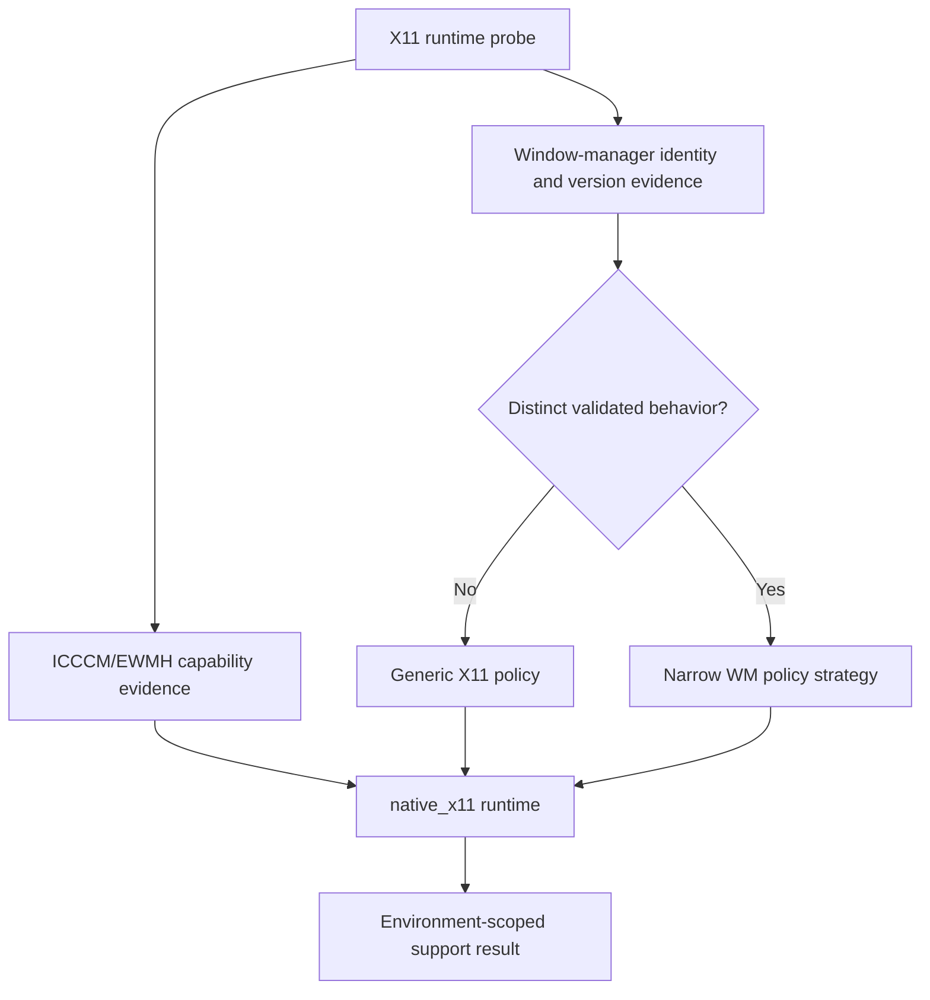

# X11 Backend Identity Research

## Question

Should GNOME on native X11 use the shared `native_x11` backend, or should the converged architecture introduce a dedicated GNOME/X11 backend identity immediately?

## Repository Evidence

The current implementation models native X11 and XWayland compatibility as separate backend identities while reusing mechanisms:

| Identity | Presentation mechanism | Discovery mechanism | Classification |
| --- | --- | --- | --- |
| `native_x11` | `_XcbIntegration` | `_WmctrlTracker` using `wmctrl`, `xwininfo`, and `xprop` | Currently `true_overlay` |
| `xwayland_compat` | `_XcbIntegration` | `_WmctrlTracker` | `degraded_overlay` on a Wayland session |

The native X11 selector does not branch on desktop environment or window manager. GNOME/Mutter, KDE/KWin, Xfce, and other native X11 sessions therefore share `native_x11` identity.

The shared implementation is currently thin: `_XcbIntegration` delegates input transparency to Qt, while `_WmctrlTracker` consumes standard X11/EWMH-facing tools. No current code establishes GNOME-specific X11 presentation or discovery behavior.

## External Evidence

The Extended Window Manager Hints specification provides a desktop-independent interoperability contract on top of ICCCM. It requires the window manager to publish supported hints through `_NET_SUPPORTED`, provides `_NET_ACTIVE_WINDOW`, geometry, window type, fullscreen, above, skip-taskbar, and related state conventions, and explicitly permits window-manager policy differences.

Source: [Extended Window Manager Hints specification](https://specifications.freedesktop.org/wm/latest-single/)

Qt documents window flags as requests whose realized behavior can differ from requested flags and can depend on the active window manager. This means runtime evidence and validation are required; it does not imply that every window manager needs a separate backend identity.

Sources: [QWindow flags](https://doc.qt.io/qt-6/qwindow.html), [Qt window types and flags](https://doc.qt.io/qt-6/qt.html)

Mutter owns window management, compositing, focus, workspace, and monitor behavior for GNOME. Its `MetaWindow` is a display-agnostic abstraction with protocol-specific implementations, which reinforces separating display-protocol behavior from compositor/window-manager policy.

Sources: [Mutter overview](https://mutter.gnome.org/), [Mutter MetaWindow](https://mutter.gnome.org/meta/class.Window.html)

## Architectural Options

### Option A: Dedicated `gnome_x11` backend immediately

Pros:

- Makes the first validated environment explicit in backend identity.
- Provides an obvious location for future Mutter workarounds.

Cons:

- Creates a backend with no distinct behavior today.
- Encourages parallel `gnome_x11`, `kwin_x11`, and other nominal bundles that duplicate protocol mechanics.
- Conflates support-matrix scope with runtime implementation identity.
- Risks selecting by desktop name rather than operational X11 capabilities.

### Option B: One `native_x11` backend with no policy seam

Pros:

- Matches current implementation and X11 interoperability standards.
- Avoids unnecessary identities.

Cons:

- Provides no explicit location for window-manager-specific policy if validation uncovers it.
- Can lead to conditionals leaking into the shared integration.

### Option C: One `native_x11` protocol backend with capability probing and optional WM policy

Pros:

- Keeps protocol/session identity stable.
- Uses `_NET_SUPPORTED` and operational probes rather than desktop names for generic guarantees.
- Allows a `MutterX11Policy` or another narrow strategy only when behavior differs.
- Keeps support claims scoped separately from implementation reuse.
- Gives future KDE/KWin X11 validation a path without redesigning composition.

Cons:

- Adds a policy seam that must remain narrow to avoid becoming a second selector.
- Requires clear rules for when a policy implementation is warranted.

## Recommendation

Use Option C.

GNOME native X11 should remain `native_x11`. The project should validate that runtime specifically on Ubuntu 24.04.4 LTS under GNOME/Mutter and scope the release support claim to that environment. A generic implementation does not imply that every X11 desktop is supported.

The converged design should include:

1. X11 capability evidence for the EWMH/window behaviors the overlay requires.
2. Window-manager identity/version in diagnostics and validation records.
3. A narrow optional policy strategy owned by the X11 backend.
4. A rule that a WM-specific policy is introduced only for a demonstrated behavioral difference that cannot be represented by generic capability handling.
5. Separate identities for native X11 and XWayland compatibility even while mechanisms are reused.

This structure supports the current GNOME project and leaves a clean path for future KDE/KWin work without implementing it now.

