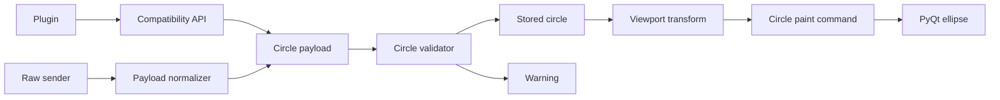

# Circle Shape Support: Detailed Design

## Overview

EDMC Modern Overlay will add a backward-compatible circle primitive to the legacy `Overlay.send_shape` compatibility API. Plugin authors will be able to send an outlined and optionally filled circle that is positioned by its centre on the legacy 1280×960 virtual canvas. The standalone PyQt overlay client will render the circle with `QPainter.drawEllipse`.

The change extends the existing legacy-shape pipeline. It does not change the semantics, payload format, rendering, or validation of existing rectangle or vector payloads.

## Detailed Requirements

1. A caller can publish a circle through `send_shape` using a stable payload ID, the shape token `"circle"`, `x`, `y`, `radius`, `thickness`, `color`, `fill`, and `ttl`.
2. The caller-facing form supports named circle geometry, for example:

   ```python
   overlay.send_shape(
       "myplugin-radius",
       "circle",
       color="#80d0ff",
       fill="#1a1a1acc",
       x=100,
       y=100,
       radius=50,
       thickness=2,
       ttl=5,
   )
   ```

3. The first argument remains a stable ID. Republishing the same ID replaces the current circle and refreshes its TTL; existing clear-by-ID behavior remains usable.
4. `x` and `y` are the circle centre, not a bounding-box corner.
5. `radius` and `thickness` are positive legacy-canvas units. A non-positive or non-numeric value drops the incoming circle and logs a warning. Invalid input must not overwrite a currently visible shape with the same ID.
6. `color` sets the border/stroke colour. `fill` sets the interior colour, and an empty or `none` fill is transparent. Existing QColor-compatible named and hexadecimal colour strings remain supported.
7. Existing TTL behavior is retained: positive values expire after that many seconds; non-positive values persist until replacement or clearing.
8. Rectangles retain their current positional signature and behavior. Vectors retain their current `send_raw` contract and behavior.
9. Raw legacy and TCP-ingested circle payloads follow the same validation, storage, and rendering behavior as compatibility-helper circles.
10. The circle participates in current payload grouping, anchoring, viewport mapping, opacity control, logging/tracing, and cycle-target selection.

## Architecture Overview



The design keeps the compatibility layer responsible for assembling the wire payload, while the overlay client remains the authoritative validator because it receives all payload sources. The client derives a square bounding box from the circle centre and radius, then passes it through the existing legacy-shape transform path. A dedicated paint command draws the transformed bounds as an ellipse.

## Components and Interfaces

### Compatibility API

Extend `Overlay.send_shape` so it accepts existing rectangle calls unchanged and accepts `circle` calls with keyword geometry. The public API must preserve `shapeid` as the first positional argument and `shape` as the second.

For `shape == "circle"`, the helper emits these fields: `type`, `shape`, `id`, `color`, `fill`, `x`, `y`, `radius`, `thickness`, and `ttl`. It must not emit synthetic rectangle `w`/`h` fields for a circle.

For `shape == "rect"`, payload construction and the existing positional arguments remain unchanged.

### Raw payload normalization

The normalizer recognizes `shape == "circle"` and carries `radius` and `thickness` through from the raw payload. It retains the established normalization of ID, colours, coordinates, TTL, and optional source-plugin metadata. It does not independently decide whether a circle is drawable; definitive validation occurs once in the client processor.

### Client storage and validation

The legacy processor adds a circle branch before the existing unknown-shape fallback.

It must:

- coerce `x`, `y`, `radius`, and `thickness` deterministically to integer legacy-canvas units;
- accept only strictly positive radius and thickness;
- log one actionable warning identifying the payload ID and invalid geometry when validation fails;
- return the no-repaint result and avoid store mutation when invalid;
- store valid circles as a first-class `circle` item, including colour, fill, centre, radius, thickness, TTL, transform metadata, update timestamp, and plugin attribution;
- include all visual fields in the deduplication snapshot so centre, radius, thickness, border, fill, and transform changes invalidate the previous rendering.

### Transform and command construction

The render surface adds a circle-command builder and dispatch entry. It derives the logical bounding square:

```text
left   = centre_x - radius
top    = centre_y - radius
width  = 2 × radius
height = 2 × radius
```

It passes that square through the existing rectangle transform and group-placement machinery. This makes circle placement consistent with all legacy shapes, including Fill mode, user offsets, anchoring, justification, payload nudging, and cycle target positioning.

The builder creates a pen from `color` and `thickness`; `none` or invalid border values use no pen, matching rectangle handling. It creates a brush from `fill`; empty, `none`, or invalid fills render transparent, matching rectangles. The command reports the transformed square as its visual/group bounds and uses its centre as the cycle anchor.

### PyQt rendering

The new paint command follows the rectangle command’s opacity behavior: copy and alpha-adjust a non-empty pen and brush when global payload opacity is below 100 percent, then set them on the existing painter.

The command calls:

```python
painter.drawEllipse(mapped_x, mapped_y, mapped_width, mapped_height)
```

No new render hint is enabled. The existing painter configuration remains authoritative, avoiding a behavior change for other primitives. Qt’s `QPainter.drawEllipse` uses the current pen and brush, and the requested thickness is set through `QPen`.

### Documentation

Update the public shape API reference, raw-payload reference, getting-started example, concepts/FAQ support statement, and rendering-pipeline explanation. Document that a logical circle follows the same viewport mapping as other legacy shapes; if a display mode applies non-uniform mapping, the mapped result may be elliptical.

## Data Models

### Circle wire payload

```json
{
  "event": "LegacyOverlay",
  "type": "shape",
  "shape": "circle",
  "id": "myplugin-radius",
  "color": "#80d0ff",
  "fill": "#1a1a1acc",
  "x": 100,
  "y": 100,
  "radius": 50,
  "thickness": 2,
  "ttl": 5
}
```

### Stored circle data

| Field | Meaning |
| --- | --- |
| `color` | Border colour specification. |
| `fill` | Fill colour specification, defaulting to transparent. |
| `x`, `y` | Centre in legacy-canvas coordinates. |
| `radius` | Positive legacy-canvas radius. |
| `thickness` | Positive logical stroke width. |
| `__mo_ttl__` | Normalized TTL used by the store. |
| `__mo_transform__` | Optional current transform metadata. |
| `__mo_updated__` | Timestamp used for observability and replacement handling. |

## Error Handling

| Condition | Behavior |
| --- | --- |
| Missing/non-numeric/non-positive radius | Drop the circle; warning includes ID and radius; do not mutate the existing item. |
| Missing/non-numeric/non-positive thickness | Drop the circle; warning includes ID and thickness; do not mutate the existing item. |
| Invalid border colour | Render without a border, matching rectangle behavior. |
| Empty, `none`, or invalid fill | Render transparent fill, matching rectangle behavior. |
| Unsupported shape token | Preserve current unknown-shape behavior. |
| Overlay unavailable | Preserve the compatibility layer’s existing rate-limited warning. |

## Testing Strategy

### Unit tests

- Compatibility API: valid circle produces the precise wire payload; existing positional rectangle invocation is unchanged.
- Raw normalization: circle radius and thickness survive the raw/TCP normalization path.
- Legacy processor: valid circle creates a `circle` store item; invalid radius and thickness each log and leave a same-ID existing circle untouched; replacement refreshes TTL; all geometry and paint fields affect the dedupe snapshot.
- Paint command: a recording painter receives `drawEllipse` with transformed coordinates plus offsets; pen width equals thickness; transparent fill produces no brush; opacity modifies both pen and brush colour without mutating the command’s originals.
- Render-surface integration: circle dispatch occurs; transform/anchor group bounds are derived from the square; cycle anchor is the mapped centre; existing rectangle command tests continue to pass unchanged.

### Harness test

Add a harness test covering a raw/TCP circle payload crossing plugin-side normalization and publication. It must confirm the published `LegacyOverlay` event retains circle geometry. Add an invalid-geometry case to confirm it does not become a drawable client item when replayed.

### Regression gate

Run focused unit and harness tests first, then the headless project suite and GUI-enabled project check. Do not treat renderer work as complete without the GUI-enabled test target because the production draw call is PyQt-specific.

## Appendices

### Technology choices

| Choice | Rationale | Trade-off |
| --- | --- | --- |
| `QPainter.drawEllipse` | Native PyQt6 primitive; uses current pen and brush and directly supports bounded ellipse drawing. | Mapped bounds may become non-circular under non-uniform transforms. |
| Reuse rectangle transform | Preserves existing group placement, Fill behavior, opacity, and cycle integration. | A dedicated geometric-circle transform would be more complex but is not required now. |
| Client-side authoritative validation | Covers compatibility, raw, and TCP senders consistently. | Invalid helper calls may travel to the client before being rejected. |
| New `circle` store/paint kind | Keeps rectangle and vector contracts behavior-scoped. | Adds one dispatch path and a small amount of duplicated command setup. |

### Research findings

Qt documents `drawEllipse` centre/radius and bounding-rectangle overloads; this design selects the bounding-rectangle form because it integrates with the existing legacy rectangle transform. Qt also documents that pen width affects the rendered stroke extent, so group bounds intentionally use the transformed geometry rather than stroke-perfect extents. Relevant references: [QPainter](https://doc.qt.io/qt-6/qpainter.html), [QPen](https://doc.qt.io/qt-6/qpen.html), and [Qt’s coordinate-system guidance](https://doc.qt.io/qt-6/coordsys.html).

The repository already uses `drawEllipse` for vector point markers, verifies it with a recording painter, and routes all legacy content through a centralized client processor. This supports adding a sibling circle path rather than modifying vector behavior.

### Alternative approaches

- **Represent a circle as a one-point vector marker:** rejected because marker radius, stroke, fill, and payload semantics do not match the requested public shape API.
- **Add a generic SVG/path payload:** rejected as unnecessary surface area for one primitive and harder to preserve legacy compatibility.
- **Implement a circle only in the compatibility API:** rejected because raw/TCP senders would remain inconsistent and invalid geometry would have no common validation point.

## Phase status

| Phase | Description | Status |
| --- | --- | --- |
| 1 | Requirements clarification | Completed |
| 2 | Repository and Qt research | Completed |
| 3 | Detailed design | Completed |
| 4 | Implementation plan | Completed |
