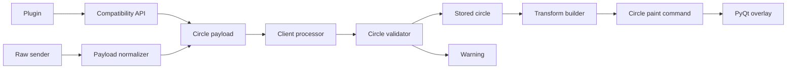

# Circle shapes: payload and PyQt rendering research

## Scope

Research the smallest backward-compatible path for adding a `circle` form to the legacy `Overlay.send_shape` helper, while rendering it in the PyQt overlay client.

## Existing contract

`EDMCOverlay.edmcoverlay.Overlay.send_shape` currently accepts a stable ID, shape name, border/fill colours, top-left rectangle coordinates, dimensions, and TTL. It emits a `LegacyOverlay` payload directly to the in-process publisher.

The client later processes the legacy payload through `process_legacy_payload`. It currently normalises `rect` into a `LegacyItem(kind="rect")`, keeps unknown shapes only for future support, and supplies no paint command for those unknown kinds. The renderer dispatches only `message`, `rect`, and `vector` items.

There is a separate raw/TCP path. `normalise_legacy_payload` must explicitly preserve `radius` and `thickness` so externally supplied raw circle payloads reach the same client-side validation and rendering path.

## Existing rendering seam

`RenderSurfaceMixin._build_rect_command` already converts a virtual-canvas rectangle through group anchoring, placement transforms, and viewport scaling. It produces pixel bounds, group bounds, a cycle anchor, a `QPen`, and a `QBrush`. `_RectPaintCommand.paint` applies payload opacity and calls `QPainter.drawRect`.

The PyQt vector-marker adapter already calls `QPainter.drawEllipse(QPoint(x, y), radius, radius)`, proving the deployed PyQt6 dependency and test doubles support ellipse painting.

## Proposed data flow



## Payload proposal

The canonical wire shape should be:

```json
{
  "event": "LegacyOverlay",
  "type": "shape",
  "shape": "circle",
  "id": "myplugin-radius",
  "color": "#80d0ff",
  "fill": "#1a1a1acc",
  "x": 100,
  "y": 100,
  "radius": 50,
  "thickness": 2,
  "ttl": 5
}
```

- `id` stays the stable replacement/clear key.
- `x`, `y` are the circle centre in the existing 1280x960 virtual canvas.
- `radius` and `thickness` are positive integer logical-canvas units.
- `color` controls the stroke and `fill` controls the interior. Empty/`none` fill remains transparent, matching rectangles.
- Positive TTL values expire; non-positive TTL values follow the existing persistence behavior.
- Invalid or missing numeric geometry (`radius <= 0` or `thickness <= 0`) is dropped at client-side normalization with a warning, before it replaces an existing stored circle.

## API compatibility design

Extend `send_shape` without changing the rectangle call pattern. Existing positional rectangle calls must remain valid. The circle form uses keyword-only `radius` and `thickness`, with `w` and `h` omitted:

```python
overlay.send_shape(
    "myplugin-radius",
    "circle",
    color="#80d0ff",
    fill="#1a1a1acc",
    x=100,
    y=100,
    radius=50,
    thickness=2,
    ttl=5,
)
```

The helper must preserve all supplied circle fields on its emitted payload and avoid interpreting centre coordinates as rectangle top-left coordinates.

## Transform and draw design

To reuse the existing group/viewport transform pipeline, convert the logical circle to a square bounding rectangle before calling the existing rectangle transform helper:

- logical left/top: `x - radius`, `y - radius`
- logical width/height: `2 * radius`

The resulting mapped pixel bounds feed a new `_CirclePaintCommand`. It uses the existing opacity-aware pen/brush behavior, but calls `QPainter.drawEllipse(mapped_x, mapped_y, mapped_width, mapped_height)`.

`QPainter.drawEllipse` paints using the active pen and brush. Qt documents centre/radii and bounding-rectangle overloads; the latter fits this transform reuse. Use antialiasing only if the surrounding painter already enables it—do not change global render hints in this feature. Qt also notes that a stroke extends beyond the given geometric bounds by its pen width, so cycle/group bounds should use the same mapped square convention as rectangles rather than attempting stroke-perfect bounds.

## Tests and documentation surfaces

| Layer | Existing pattern | Circle coverage needed |
| --- | --- | --- |
| Compatibility API | `Overlay.send_shape` / raw normalization | emitted wire fields; old positional rectangles unchanged |
| Client normalization | `tests/test_legacy_processor.py` | valid circle stored; non-positive radius/thickness dropped and logged; ID replacement + TTL contract |
| Paint command | `overlay_client/tests/test_paint_commands.py` | `drawEllipse` receives mapped bounds and offsets; opacity-adjusted pen/brush preserved |
| Render integration | `overlay_client/tests/test_render_surface_mixin.py` | circle dispatch, scaled/anchored bounding square, group/cycle bounds |
| Harness | `tests/test_harness_legacy_tcp_ingestion.py` | raw circle passes through TCP normalization and is published; invalid raw geometry does not publish/store |
| Developer docs | `docs/wiki/send_shape-API.md`, `send_raw-API.md`, FAQ/Concepts, rendering pipeline | API signature, coordinate semantics, invalid-value behavior, circle support list |

## Relevant external references

- [Qt QPainter](https://doc.qt.io/qt-6/qpainter.html): `drawEllipse` supports both centre/radius and bounding-rectangle overloads; antialiasing improves circle edges.
- [Qt QPen](https://doc.qt.io/qt-6/qpen.html): pen width controls stroke width; width zero creates a cosmetic one-pixel pen and is therefore not suitable for the requested invalid-thickness policy.
- [Qt coordinate system](https://doc.qt.io/qt-6/coordsys.html): `QRectF` avoids integer-boundary quirks when exact geometric bounds are needed.

## Risks and mitigations

| Risk | Mitigation |
| --- | --- |
| Breaking third-party rectangle callers | Retain the existing rectangle signature and add focused regression tests for positional rectangle calls. |
| Circle payload works via `send_shape` but not raw/TCP ingestion | Preserve circle fields in `normalise_legacy_payload` and add a harness test. |
| Invalid replacement removes a visible circle | Validate before any store mutation; assert the old item remains. |
| Group placement or Fill scaling diverges from shapes | Reuse the rectangle transform pipeline with a derived square bounding box. |
| Non-uniform viewport mapping turns a logical circle into an ellipse | Reuse the current legacy-shape mapping by design; add a test documenting the mapped-bounds behavior. Revisit only if the product requirement is geometric circularity under non-uniform scaling. |

## Phase status

| Phase | Description | Status |
| --- | --- | --- |
| 1 | Requirements clarification | Completed |
| 2 | Repository and Qt research | Completed |
| 3 | Detailed design and implementation plan | Completed |
