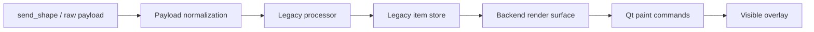

# Circle Feature / Backend Refactor Integration Design

## Overview

This integration combines first-class circle rendering and opt-in shape stroke
thickness with the backend-refactor branch. The target branch remains the owner
of surrounding architecture and behavior; the source contributes the circle
payload contract, validation, rendering, tests, documentation, and inspection
utility.

## Detailed Requirements

- Merge the source feature into the backend-refactor branch as one reviewed
  integration.
- Preserve all backend-refactor behavior unless the source feature explicitly
  extends it.
- Preserve the target version of the externally managed grouping configuration.
- Support circle payloads with center-point coordinates, positive radius,
  positive thickness, border color, and optional fill.
- Support optional positive rectangle thickness without changing rectangles that
  omit it.
- Render explicit rectangle strokes with square mitered corners.
- Preserve validation, payload compatibility, opacity, fill, and pen-isolation
  coverage.
- Do not commit until all automated and manual validation gates pass.

## Architecture Overview

The feature extends the existing shape path. Circle input normalizes to a
stored circle item, which is dispatched by the render surface to an ellipse
paint command. Rectangle and circle explicit thickness values resolve after
group scaling. The target branch's render-surface and backend lifecycle remain
the governing integration context.

## Components and Interfaces

| Component | Integration responsibility |
| --- | --- |
| Public overlay API | Preserve existing calls; add circle and opt-in rectangle thickness behavior. |
| Payload processor | Validate positive geometry, drop invalid shapes with warnings, and avoid replacing an existing item when invalid. |
| Render surface | Dispatch circle items and resolve physical pen widths using the current group scale. |
| Paint commands | Draw circles through Qt and isolate opacity-adjusted pens/brushes. |
| Tests | Prove payload, processor, rendering, scale, fill, and TCP contracts survive the merge. |
| Grouping configuration | Remain entirely target-owned for this integration. |

## Error Handling

- Git conflicts are resolved manually against the target architecture, never by
  wholesale selection of the source file.
- Invalid circle/explicit rectangle thickness remains a warning-and-drop path.
- A failed automated gate blocks the merge commit and requires correction or an
  explicit documented deferral.
- If manual overlay inspection exposes grouping-transform placement behavior,
  record it as a gallery limitation rather than altering the managed grouping
  configuration.

## Testing Strategy

1. Run focused payload/processor/paint/render/harness tests after resolving
   conflicts.
2. Run GUI-enabled paint tests to exercise the PyQt paths.
3. Run the EDMC Python compatibility script and the complete project gate.
4. Inspect a live overlay: circle fill/border/scale, explicit thick rectangle
   square corners, and omitted-thickness rectangle legacy appearance.

## Alternative Approaches

| Approach | Decision | Reason |
| --- | --- | --- |
| Merge the complete feature branch | Selected | Retains implementation, tests, API docs, and provenance together. |
| Cherry-pick selected files | Rejected | Would make it easy to omit coupled validation, test, or documentation changes. |
| Accept the source grouping configuration | Rejected | It is managed externally and unrelated to the feature contract. |
| Use the gallery as a Fill-mode concentricity test | Rejected | Per-ID transforms make it an invalid physical-placement assertion. |
