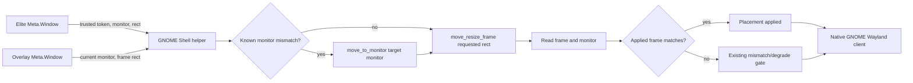

# GNOME Wayland Overlay Monitor Placement: Detailed Design

## Overview

The native GNOME Wayland overlay can be attached to the monitor on which it was
previously created even when Elite Dangerous is on another monitor. In the
observed two-monitor arrangement, the requested global rectangle was
`(0, 248, 3440, 1440)`, while the GNOME Shell helper read back
`(3440, 248, 3440, 1440)`: exactly one monitor width to the right.

This design corrects monitor assignment in the GNOME Shell helper before its
existing frame-resize operation. It does not change rendering, payload
processing, window discovery, backend selection, the X11 backend, or the
XWayland-compatibility backend.

The normal native GNOME presentation sequence becomes:

1. Resolve the target Elite window by its trusted Shell token.
2. Obtain its authoritative Shell monitor index.
3. Read the current overlay monitor index.
4. If both indexes are valid and differ, move the overlay to the target monitor.
5. Resize/move its frame to the existing requested global logical rectangle.
6. Re-read frame and monitor state and apply the existing fail-closed geometry
   gate.

The move is intentionally conditional. A matching monitor must never cause an
extra compositor move or focus/stacking churn.

## Detailed Requirements

### Functional requirements

1. Native GNOME Wayland presentation must use the Elite window's Shell monitor
   index as the placement authority. It must not infer the monitor from primary
   status, display order, Qt screens, or rectangle origin.
2. When the overlay and target monitor indexes are both valid and unequal, the
   helper must invoke `Meta.Window.move_to_monitor(targetMonitor)` before
   `Meta.Window.move_resize_frame(...)`.
3. When the indexes match, the helper must retain the current no-op/resize
   behavior. In particular, a matching frame and monitor must not produce a
   move call.
4. A missing, invalid, or unavailable monitor index must not trigger a monitor
   move. The existing frame-resize path and its readback validation remain in
   effect.
5. A failed or unavailable monitor-move operation must be observable in helper
   diagnostics, but must not incorrectly report placement success. The helper
   may still attempt the existing resize operation because it is the proven
   fallback behavior for configurations where resize alone works.
6. After the operation, the helper must continue to read the actual frame
   rectangle and compare it with the requested rectangle using the existing
   tolerance. A method call returning normally is not proof of placement.
7. Existing stacking, click-through, chrome-free, focus-safety, retry, and
   persistent-mismatch behavior must remain unchanged.

### Compatibility and non-functional requirements

1. The change is limited to the native GNOME Shell presentation implementation.
   Native X11 and XWayland compatibility must receive no code or behavior
   changes.
2. The public helper protocol and the Python-side presentation payload schema
   remain unchanged. The target monitor is already available to the helper
   during an attach operation.
3. Existing diagnostic strategy probes remain diagnostic only. Production
   placement must not route through fullscreen or other probe strategies.
4. The correction must be idempotent across repeated presentation cycles: once
   placed on the target monitor, subsequent cycles perform only the existing
   frame matching/resize work.
5. Failure remains fail-closed. If applied geometry does not match, the client
   must continue to suppress/degrade the visible overlay rather than accepting
   a wrong-monitor result.

## Architecture Overview



The GNOME Shell helper remains the compositor-owned presentation endpoint. The
native Wayland client continues to supply an attach request and independently
validates the helper's applied rectangle. No generic follow surface imports or
dispatches GNOME-specific presentation behavior; the existing backend bundle
boundary remains intact.

## Components and Interfaces

### GNOME Shell presentation helper

The helper's normal attach path already has the overlay `Meta.Window`, the
requested rectangle, and the target-window payload. It will gain a small
monitor-transfer decision before its existing resize branch.

Inputs:

| Input | Source | Use |
| --- | --- | --- |
| `targetMonitor` | Target Elite Shell payload | Authoritative desired monitor index |
| `currentMonitor` | Overlay `Meta.Window.get_monitor()` | Determines whether a transfer is necessary |
| `requestedRect` | Existing attach request | Existing global logical frame target |
| `rectTolerance` | Existing attach request | Existing readback-match threshold |

Outputs remain the existing presentation result:

| Output | Meaning |
| --- | --- |
| `placement` | A placement operation was attempted or the frame already matched |
| `appliedRect` | Post-operation frame readback |
| `degradeReasons` | Existing mismatch/unsupported/error signals, with a monitor-transfer reason when applicable |
| optional diagnostics | Before/after monitor and frame data, plus the chosen presentation action |

The helper should use clear action labels such as `move_to_monitor_then_resize`,
`skipped_matching_frame`, `move_resize_frame`, and
`move_to_monitor_error_then_resize` so support logs identify the decision.

### Native GNOME Wayland backend consumer

No new client-facing interface is required. It continues to:

- resolve the target through the helper;
- submit the existing attach request;
- require the helper-reported applied rectangle to match within tolerance;
- retry a bounded number of times for settled readback; and
- degrade/suppress after persistent mismatch.

The existing `wrong_monitor_applied_rect` and
`persistent_applied_rect_mismatch` evidence therefore remains the final safety
net if Mutter does not settle immediately or rejects the move.

### Excluded backend consumers

The native X11 and XWayland-compatibility consumers continue using their own
window-system implementation. They must not import, call, or conditionally
dispatch the GNOME helper monitor-transfer logic. Experimental raster behavior
also remains separately feature-gated; this change does not alter renderer
selection or shell-raster presentation.

## Data Models

No wire-schema changes are required. The following internal decision model
defines the helper behavior:

| Field | Type | Validity | Description |
| --- | --- | --- | --- |
| `targetMonitor` | integer or null | Non-negative integer | Target Elite monitor from Shell state |
| `currentMonitor` | integer or null | Non-negative integer | Current overlay monitor from Shell state |
| `monitorTransferRequired` | boolean | `true` only for two valid unequal indexes | Guards `move_to_monitor` |
| `requestedRect` | rectangle | Existing valid rectangle contract | Desired global logical frame bounds |
| `appliedRect` | rectangle or null | Read after operation | Actual frame bounds used by the existing gate |
| `moveResizeAction` | string | Diagnostic | Exact normal-path decision and fallback outcome |

Decision pseudocode:

```text
currentFrame = read overlay frame
currentMonitor = read overlay monitor
targetMonitor = normalize target monitor

if valid(targetMonitor) and valid(currentMonitor) and currentMonitor != targetMonitor:
    try move overlay to targetMonitor
    record monitor-transfer outcome

if currentFrame matches requestedRect and currentMonitor == targetMonitor:
    record skipped_matching_frame
else:
    run existing move_resize_frame fallback chain

appliedFrame = read overlay frame
appliedMonitor = read overlay monitor
require appliedFrame to match requestedRect within tolerance
```

The implementation may re-read the frame after monitor transfer before deciding
whether a resize is still needed. It must not treat a matching frame on the
wrong monitor as sufficient; monitor equality is part of the no-op condition.

## Error Handling

| Condition | Helper behavior | Client-visible result |
| --- | --- | --- |
| Target or overlay monitor unavailable | Skip transfer and retain existing resize/readback flow | Existing mismatch or degraded result, never a false success |
| `move_to_monitor` unavailable | Record unsupported monitor transfer; attempt existing resize | Existing readback gate decides success |
| `move_to_monitor` throws | Record transfer error; attempt existing resize | Existing readback gate decides success |
| Resize unavailable/throws | Preserve current unsupported/error behavior | Degraded presentation |
| Frame readback lags | Preserve bounded client retry behavior | Pending once, then applied only on match |
| Frame remains on wrong monitor | Preserve mismatch reasons and persistent backoff | Overlay remains suppressed/degraded |

Monitor transfer must not add a focus request, a fullscreen operation, a
standalone-window change, or a Qt geometry call. The existing `make_above`
stacking action remains in its current location and keeps its current error
handling.

## Testing Strategy

### Helper contract tests

Add deterministic tests against the helper source/decision contract that prove:

1. The normal path reads both target and overlay monitor state.
2. It calls `move_to_monitor` before `move_resize_frame` only for a valid
   mismatch.
3. It skips the monitor move for a matching monitor and for invalid monitor
   state.
4. The normal path still reads post-operation frame and monitor state.
5. A monitor-transfer failure retains the frame-readback mismatch gate rather
   than declaring placement applied.

If the helper decision is extracted into a pure JavaScript utility, run direct
unit cases against mismatch, match, invalid-index, unavailable-method, and
exception scenarios. If GNOME Shell's runtime environment prevents direct
JavaScript execution in the test suite, use the project's established source
contract tests and retain the Python presentation-state tests as the protocol
gate.

### Python presentation tests

Retain and run existing native-helper runtime tests that verify:

- a one-cycle applied-rectangle lag retries once and succeeds only on a match;
- a persistent wrong-monitor rectangle is backed off and remains degraded; and
- request validation still requires the target content/frame rectangle and the
  existing tolerance rules.

No `load.py` lifecycle changes are planned, so a plugin harness test is not
required for this change. If implementation expands beyond the helper into
backend wiring, add a harness test for that wiring before landing it.

### Manual GNOME Wayland acceptance matrix

Run on the actual GNOME Wayland session after installing/reloading the helper:

| Scenario | Expected result |
| --- | --- |
| Game primary, overlay initially secondary | Overlay transfers to primary; requested and applied rectangles match |
| Game secondary, overlay initially primary | Overlay transfers to secondary; requested and applied rectangles match |
| Game moves between monitors repeatedly | Each transfer follows the game without accumulating an offset |
| Already co-located game and overlay | No unnecessary monitor-transfer action |
| Click-through and game focus | Overlay remains click-through and does not steal focus |
| Stacking and resize | Overlay remains above the game and follows rect changes |
| Transfer API unavailable/error (controlled development check) | Existing failure gate prevents false success |

Capture helper diagnostics for pre/post monitor, requested/applied rectangle,
action label, and degrade reasons. Successful visual placement alone is not
sufficient; the helper readback must match as well.

## Appendices

### Technology choices

`Meta.Window.move_to_monitor()` followed by `move_resize_frame()` is the chosen
approach because Mutter documents the first operation as changing a window's
monitor assignment while preserving its relative top-left position, and the
second as fitting the window frame to supplied bounds. The operations address
the two distinct concepts exposed by the failure: monitor ownership and frame
geometry. See the [Mutter Meta.Window API](https://gnome.pages.gitlab.gnome.org/mutter/meta/class.Window.html).

### Alternatives considered

| Alternative | Decision | Rationale |
| --- | --- | --- |
| Resize only | Rejected | It is the current behavior and produced the full-monitor displacement. |
| Infer target from global coordinates or primary monitor | Rejected | It breaks nonstandard layouts and conflicts with the Shell-provided target monitor. |
| Use diagnostic strategy probes in production | Rejected | They are intentionally experimental and include fullscreen variants. |
| Move after resize | Rejected | Mutter preserves relative top-left during a monitor move, risking a post-resize displacement. |
| Change X11/XWayland code for parity | Rejected | The fault and API are GNOME Wayland specific; changing those backends risks regressions. |
| Disable existing mismatch gate | Rejected | It would make a visibly wrong overlay appear healthy. |

### Constraints and remaining live-session questions

The sandbox cannot access the GNOME session bus, so real-session validation is
required to establish exact compositor timing. The acceptance matrix explicitly
checks whether monitor assignment settles in the same cycle, whether
click-through/focus behavior is preserved, and whether reverse monitor handoff
works. A transient lag is acceptable only if the existing bounded retry reaches
a matching applied rectangle; persistent mismatch remains a failure.
