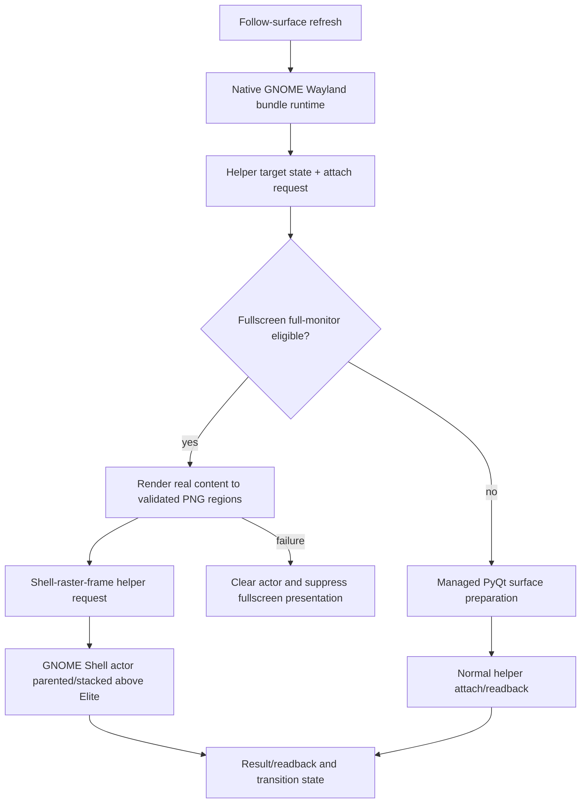

# GNOME Wayland Fullscreen Shell-Raster Routing: Detailed Design

## Overview

On the affected GNOME Wayland session, Mutter leaves the externally managed
PyQt overlay on its prior monitor even though `Meta.Window.move_to_monitor()`
and `move_resize_frame()` both return normally. The native GNOME backend must
therefore stop treating a PyQt `Meta.Window` as the fullscreen presentation
surface. For a verified borderless/fullscreen target that fills its monitor, it
will present the overlay through the already implemented GNOME Shell raster
actor. For normal windowed targets, it will retain managed PyQt presentation.

This is a backend-internal presenter decision for `gnome_shell_wayland`. It
does not alter X11, XWayland compatibility, target discovery, drawing payloads,
or the public helper protocol.

## Detailed Requirements

1. An eligible native GNOME fullscreen target must be rendered by a
   compositor-owned Shell actor rather than by the PyQt overlay window.
2. Eligibility requires a healthy helper, an attach request, a visible
   non-minimized fullscreen target, valid target/request rectangles, and
   target content plus request content matching the target monitor rectangle
   within the existing tolerance.
3. A non-fullscreen target must use the existing managed-PyQt path. It must
   never silently receive a fullscreen raster frame.
4. The fullscreen route must use real overlay-content PNG regions, never the
   static proof frame.
5. While fullscreen raster is selected, failure to create, transfer, or prove
   a frame must clear/suppress the raster presentation. It must not expose the
   known-misplaced PyQt window as fallback.
6. Raster-to-managed and target-loss transitions must clear the Shell actor
   before committing the competing presenter. Existing focus, workspace,
   stacking, click-through, cache, and transition protections remain active.
7. Generic follow/runtime code must delegate through a bundle-owned runtime
   interface or bundle-declared capability. It must not branch on raw GNOME
   helper/backend enums to choose a presenter.
8. `native_x11` and `xwayland_compat` must retain their existing independent
   behavior and must not import GNOME helper or raster modules.

## Architecture Overview

The selection status still identifies the platform backend. The selected GNOME
bundle owns the presentation-runtime policy and injects the appropriate
runtime configuration; it is not a new user-visible backend choice. The
existing `GNOME_SHELL_RASTER` identity is treated as compatibility/development
scaffolding until a separately approved cleanup removes or migrates its public
override and status references.

## Components and Interfaces

### Backend-owned runtime profile

Lift the existing GNOME presentation-cycle configuration out of generic
`consumers.py` enum checks into a bundle-owned presentation runtime/profile.
The profile declares whether this bundle supports fullscreen Shell raster and
whether fullscreen raster failure suppresses managed-PyQt fallback. The native
GNOME bundle enables both; X11 and xcompat expose no such profile.

The generic caller supplies neutral inputs only: surface preparation callback,
real-content frame provider, visibility state, and refresh request. It invokes
the selected bundle's runtime entry point without knowing the compositor or
renderer choice.

### Native GNOME presenter policy

The existing helper-cycle transition policy remains the single owner of mode
transitions:

| Target state | Selected presenter | Required action |
| --- | --- | --- |
| Eligible fullscreen/full-monitor | Shell raster actor | Build real content, attach/refresh actor, keep PyQt suppressed |
| Windowed | Managed PyQt | Clear any prior actor, prepare/map PyQt, attach normally |
| Missing, minimized, off-workspace, helper unhealthy | None | Clear actor/reset managed state and hide |
| Fullscreen but raster cannot be proven | None | Clear/suppress; record actionable degraded reason |

No retry path may turn a raster failure into a PyQt fullscreen attach. Existing
bounded helper retries can still reattempt an eligible raster request.

### Frame export and GNOME helper

The real-content frame provider already renders the actual overlay into
transparent cropped PNG regions with checksums and cache identity. Keep its
cache and frame-rate limits. The helper retains ownership of actor creation,
target-window parenting, actor stacking, non-reactivity, and clearing. No
cross-process surface embedding or invented coordinate conversion is needed.

## Data Models

Introduce a small bundle-owned runtime configuration or protocol (exact class
name is implementation-owned) with these effective properties:

| Field | Meaning |
| --- | --- |
| `helper_presentation_enabled` | The bundle owns a GNOME helper presentation cycle |
| `fullscreen_raster_enabled` | Eligible fullscreen targets may use Shell raster |
| `suppress_managed_fallback_on_raster_failure` | Fullscreen raster failure clears/suppresses instead of using PyQt |

The existing `PresentationTransitionState`, `HelperRasterFrameRequest`, and
`ShellRasterFrameBuildResult` remain the runtime state and wire models. No
DBus schema/version bump is required.

## Error Handling

| Failure | Required behavior |
| --- | --- |
| Helper unavailable or target invalid | Clear stale actor, reset mode state, hide overlay |
| Fullscreen eligibility false | Use managed PyQt only if target is genuinely windowed; otherwise suppress |
| Frame export produces no visible content | Send clear/degraded result and keep PyQt suppressed for fullscreen |
| PNG path/checksum/size invalid | Reject locally and suppress; do not send unsafe path |
| Actor attach/readback degrades | Clear actor, expose diagnostic reason, retry only under existing bounds |
| Fullscreen → windowed | Clear actor successfully before managed PyQt commits |
| Target token/monitor changes | Existing transition policy holds/clears safely, then presents only after a stable eligible sample |

## Testing Strategy

Use unit tests for pure presenter policy, profile selection, raster-frame
eligibility, fallback suppression, and transitions. Use existing helper-runtime
tests for request/clear sequencing and Shell extension source-contract tests
for actor ownership/non-reactivity. This change does not touch `load.py` or an
EDMC hook, so a plugin lifecycle harness test is not required; if implementation
needs to alter plugin startup or follow-surface lifecycle wiring beyond the
existing callback seam, add a harness test before landing it.

Manual GNOME acceptance must prove both monitor directions, fullscreen ↔
windowed transitions, target loss, focus/click-through, stacking, and an actor
clear on failure. Success requires helper diagnostics and visual alignment;
visual placement alone is insufficient.

## Appendices

### Technology choice

Shell raster is chosen because it is composed in GNOME Shell's own scene graph
relative to the target actor. It does not depend on Mutter relocating an
external Wayland client window. Its cost is PNG production and bounded refresh
latency, which the existing cropped-region/cache implementation controls.

### Rejected alternatives

- **More `move_to_monitor` order/API variants:** live probes proved both
  available variants silently leave the window on the wrong monitor.
- **Coordinate/primary-monitor heuristics:** the helper already reports the
  correct target monitor and global logical rectangle; guessing would weaken
  multi-monitor correctness.
- **Changing X11/xcompat:** those backends are unaffected and must retain their
  separate contracts.
- **Promoting a raster backend choice to generic runtime:** this would leak a
  compositor-specific presenter decision across the fix219 boundary.
