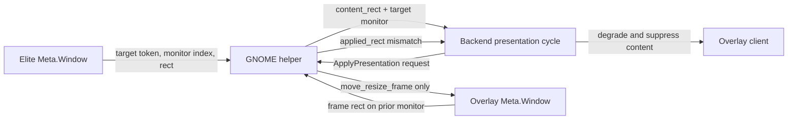

# Existing code and runtime evidence

## Scope

This research covers the native GNOME Wayland presentation path only. Native
X11 and XWayland compatibility remain separate support identities and are out
of scope for the proposed correction.

## Runtime observation

The running client repeatedly reports a healthy GNOME helper and a resolved
Elite target on monitor `1`:

```text
requested = {x: 0,    y: 248, width: 3440, height: 1440}
applied   = {x: 3440, y: 248, width: 3440, height: 1440}
delta     = [3440, 0, 0, 0]
reasons   = applied_rect_mismatch, wrong_monitor_applied_rect,
            persistent_applied_rect_mismatch
```

This is a full-width, one-monitor-right displacement. The client correctly
keeps the content suppressed after the persistent placement mismatch. The
evidence is in the local `overlay_client.log`; it contains no indication that
circle payload processing or paint commands participate in placement.

## Current flow



`helpers/gnome_shell_extension/extension.js` gathers the Elite monitor from
`Meta.Window.get_monitor()` and gathers the monitor rectangle through
`_monitorForIndex()`. In normal presentation it then calls
`window.move_resize_frame(false, requestedRect.x, requestedRect.y, ...)`.
The only existing calls to `move_to_monitor()` are diagnostic presentation
strategy probes; they are not part of normal placement.

## Backend boundary

The active selector identity is `gnome_shell_wayland` on native Wayland. The
circle merge stages renderer, legacy-payload, shape tests, and documentation
paths only; it does not stage the GNOME helper, backend bundles, tracker, or
platform-placement code.

The backend boundary is currently preserved:

- `native_x11` and `xwayland_compat` are explicit bundles, despite deliberately
  sharing the existing XCB/wmctrl implementation.
- Native Wayland uses distinct compositor instances/bundles.
- `follow_surface.py` is protected by an architecture test from importing or
  enum-dispatching GNOME helper presentation directly.

## Finding

The evidence supports, but does not yet prove, this cause: Mutter retains the
overlay's current monitor when the helper resizes it, so the requested global
rectangle is applied relative to that prior monitor. A guarded
move-to-target-monitor step before resize is the smallest plausible native
Wayland correction.

The implementation must prove the target monitor identity first and must still
require a matching `applied_rect`; it must not accept a move call as placement
success.
