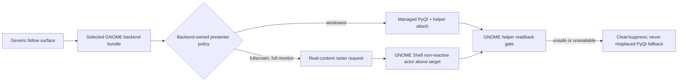

# Mutter placement probe and Shell-raster inventory

## Decision-driving live evidence

The deployed GNOME helper resolved Elite Dangerous as a fullscreen target on
monitor `1` with matching target content and monitor rectangles:

```text
target/content/monitor rect = (0, 248, 3440, 1440)
overlay before             = (3440, 248, 3440, 1440), monitor 0
```

The normal attach path reported `move_to_monitor_then_resize`, but its
post-operation readback was identical to the before state. A deliberately
diagnostic `resize_then_move_to_monitor` probe also reported both
`move_resize_frame` and `move_to_monitor` as available and successful while
the overlay remained at `(3440, 248, 3440, 1440)` on monitor `0`.

Therefore, in this Mutter session a normally-returning
`Meta.Window.move_to_monitor()` is not evidence that an external PyQt surface
was transferred. Reordering the two calls is not a viable production fix.

## Existing usable implementation

The project already has an end-to-end Shell-raster presenter:

- `render_surface.py` exports real overlay content into cropped transparent PNG
  regions through `_build_backend_shell_raster_content_frame`.
- `shell_raster_frame.py` validates controlled cache paths, size, checksums,
  frame identities, crop regions, and bounded refreshes.
- `_gnome_shell_helper_presentation.py` can turn an attach request into a
  `gnome_shell_raster_frame` request, clear it, suppress unsafe PyQt fallback,
  and coordinate managed-PyQt/raster transitions.
- The GNOME Shell extension renders the request as non-reactive Clutter actors
  attached in the compositor scene above the target window actor.

The current full-screen target qualifies for the raster route: it is visible,
not minimized, fullscreen, and its target/request rectangles match the target
monitor rectangle within tolerance.

## Current gap

The bridge is enabled only when selection is the separate
`GNOME_SHELL_RASTER` instance. The normal native GNOME selection is
`GNOME_SHELL_WAYLAND`, so it continues to use managed PyQt placement. That is
the wrong ownership model for the observed fullscreen case.



## Consequence

The monitor-transfer implementation and its diagnostics remain valuable
evidence, but they are not the production repair. The replacement must make
presenter ownership a native-GNOME-backend decision: managed PyQt for windowed
targets and Shell raster for eligible fullscreen targets.
