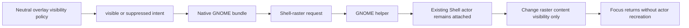

# Native GNOME Shell-Raster Content Suppression: Lessons Learned

**Status:** Confirmed from the 2026-08-28 live regression and safety rollback.

## What failed

The prior change sent `allow_unfocused_target=false` whenever the user had
unchecked “Keep overlay visible when Elite Dangerous is not the foreground
window.” In the GNOME Shell extension, an unfocused target with that flag is
classified as `target_not_focused`. The transient handling then clears or
suspends the Shell-raster frame and hides its compositor actors.

For an eligible fullscreen Elite window, the actor removal/suspension path
produced a black screen when focus returned. Restoring the pre-change
fullscreen/full-monitor continuity guard fixed the live regression, but left
the checkbox ineffective for that route.

## Lessons that constrain the replacement

1. `allow_unfocused_target` is an actor-continuity safety control, not a
   direct representation of the user’s content-visibility preference.
2. An ordinary focus transition for an eligible fullscreen Shell-raster target
   must not hide, clear, detach, destroy, or recreate the compositor actor.
3. The user preference must instead become a separate, renderer-level content
   visibility intent, applied while the actor remains attached and ready for
   focus return.
4. Unsupported or older helpers must retain the stable visible behavior. A
   failed suppression capability check must never fall back to focus-risk
   actor suspension.
5. Headless source and mock-helper tests cannot prove compositor focus-return
   safety. Repeated live focus cycles are a mandatory acceptance gate.
6. The `fix219` boundary remains in force: generic follow/runtime policy can
   express neutral intent, but only the native GNOME backend bundle may map it
   to helper protocol and compositor behavior.

## Safe flow to validate

## Non-negotiable invariants

- Retain the restored fullscreen actor-continuity authorization during normal
  focus loss.
- Keep hard lifecycle loss (target gone, incompatible geometry, session
  invalidation, shutdown) on its existing clear path.
- Exercise both the single-frame and region-raster actor paths.
- Preserve monitor placement, stacking, non-reactivity/click-through,
  fullscreen routing, and managed-PyQt fallback behavior.

