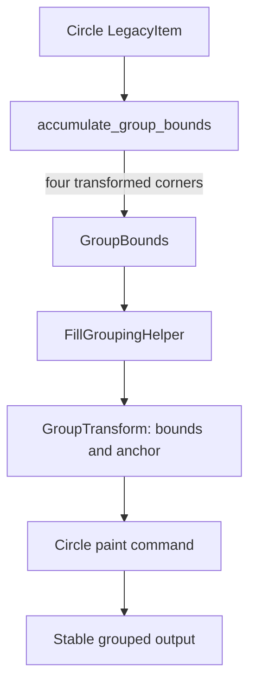

# Detailed design: stable Fill-mode grouping for circle payloads

## Overview

This change aligns the geometry used to group circle payloads with the geometry
used to render them. It removes apparent movement of a payload group when a
circle payload refreshes alongside other BioScan payloads.

The public `send_shape` API, the payload schema, and the circle paint command
remain unchanged.

## Detailed requirements

1. A `LegacyItem` whose kind is `circle` contributes its full visual extent to
   Fill-mode group bounds.
2. A circle is defined by centre coordinates `(x, y)` and a positive `radius`.
   Its untransformed logical bounds are `(x-radius, y-radius)` through
   `(x+radius, y+radius)`.
3. Transform metadata is applied to all four logical bounding-box corners
   before calculating the enclosing group bounds.
4. Messages, rectangles, vectors, and malformed payload behavior remain
   unchanged.
5. Unit coverage proves normal and transformed circle bounds and prevents the
   regression that treated circles as centre points.

## Architecture overview

## Components and interfaces

### Circle bounds accumulation

`accumulate_group_bounds(bounds, item, ...)` gains a circle-specific branch.
It reads the logical `x`, `y`, and `radius`, derives the square bounds, passes
all corners through the existing transform helper, and adds the enclosing
minimum/maximum rectangle to `GroupBounds`.

The branch uses the rectangle branch’s transform convention. This keeps its
behavior correct for current translation metadata and future transform forms
without duplicating transformation logic elsewhere.

### Fill grouping integration

`FillGroupingHelper.prepare()` requires no interface change. It already
consumes `accumulate_group_bounds()` output to build `GroupTransform` values;
correct bounds automatically produce a stable anchor and transform.

### Rendering integration

The circle renderer remains the visual authority. Its existing calculation
uses exactly the same untransformed square geometry, so the grouping path and
rendering path become consistent.

## Data model

Relevant circle item data:

| Field | Meaning |
| --- | --- |
| `x`, `y` | Centre in legacy 1280×960 logical coordinates |
| `radius` | Positive logical radius |
| `__mo_transform__` | Optional transform metadata applied before group-bound aggregation |

Derived bounds:

| Edge | Formula |
| --- | --- |
| left | `x - radius` |
| top | `y - radius` |
| right | `x + radius` |
| bottom | `y + radius` |

## Error handling

The legacy processor rejects invalid circles before storage. The bounds helper
still retains its existing `TypeError`/`ValueError` containment so corrupted or
legacy cached values do not interrupt rendering. A malformed circle therefore
does not create a new failure mode or modify bounds.

## Testing strategy

- Add a pure unit test that a circle at `(x, y)` with radius `r` expands to the
  expected square `GroupBounds`.
- Add a unit test with transform metadata to prove corners, not the centre, are
  transformed before aggregation.
- Retain existing rectangle/vector/message tests as regression protection.
- Run the focused unit module and then `make check`, which covers Ruff, mypy,
  and the full pytest suite.

## Phased delivery

| Phase | Stages | Status |
| --- | --- | --- |
| 1. Bound contract tests | 1.1 Normal circle bounds; 1.2 transformed circle bounds | Planned |
| 2. Bounds implementation | 2.1 Circle branch; 2.2 regression review | Planned |
| 3. Validation | 3.1 Focused tests; 3.2 full project gate | Planned |

## Appendix

### Technology choices

The existing pure Python bounds helper is the correct seam: it has no widget
or socket lifecycle dependency, accepts injected text-measurement concerns for
other payload kinds, and is already called by the Fill-mode grouping pipeline.

### Alternative approaches considered

- Expanding bounds in the renderer would leave grouping anchors wrong and
  duplicate geometry ownership.
- Modifying BioScan payload coordinates would be a compatibility break and
  would still leave every other circle-producing plugin affected.
- Disabling Fill-mode grouping would hide the symptom but regress established
  group placement behavior.
