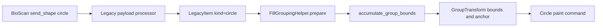

# Existing-code findings

## Data flow

## Observations

- The legacy processor validates positive circle radius and thickness, then
  stores the payload as `LegacyItem(kind="circle")`.
- The circle paint command expands centre coordinates into a square:
  `left=x-radius`, `top=y-radius`, `width=height=2*radius`.
- `FillGroupingHelper.prepare()` rebuilds group bounds every render pass using
  `accumulate_group_bounds()` and uses those bounds to choose the group anchor
  and generate a `GroupTransform`.
- `accumulate_group_bounds()` has explicit paths for message, rectangle, and
  vector items. Circles currently fall through to the generic point path,
  contributing only `(x, y)`.

## Consequence

The group transformation is based on geometry that differs from the painted
circle. Whenever the group membership or active payload set changes on a
refresh, its derived bounds and anchor can change, producing visible movement.

## Constraints

- Circle renderer behavior is the contract; do not change its coordinate model.
- Bounds must support transform metadata, so all four corners must be
  transformed before calculating min/max, as rectangles already do.
- Invalid values remain filtered by the legacy processor; group-bounds code
  should remain defensive and avoid raising for malformed cached data.
