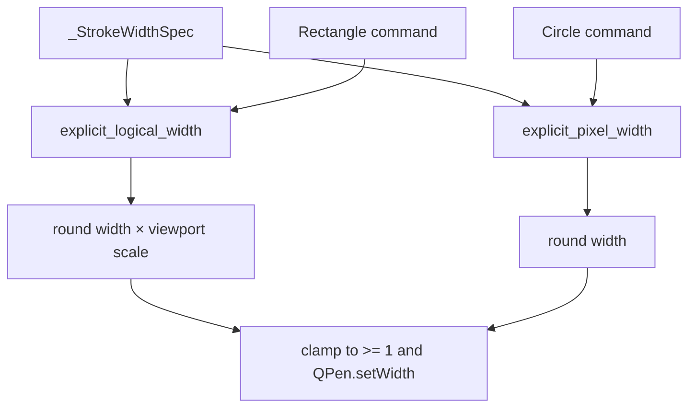

# Detailed design: pixel-width circle strokes

## Overview

Circle geometry remains part of the scaleable 1280×960 legacy canvas, but an
explicit circle `thickness` becomes a Qt logical-pixel pen width. This makes
`thickness=1` match the established thin legacy-vector stroke at every Fit or
Fill scale. Rectangles retain their existing logical-thickness behavior.

## Detailed requirements

1. A valid circle payload continues to require a positive integer `thickness`.
2. Circle `thickness=1` resolves to `QPen.width() == 1` when group scales are
   0.5, 1.0, and 2.0.
3. Other positive circle thicknesses resolve to their rounded integer pixel
   widths without Fit/Fill multiplication.
4. Explicit rectangle thickness remains `round(thickness * group_scale)`,
   clamped to at least one pixel.
5. Circle position, radius, Fill grouping, transform metadata, opacity,
   colors, joins, and public `send_shape` arguments remain unchanged.
6. Existing invalid/missing-thickness handling remains unchanged.

## Architecture overview

`_StrokeWidthSpec` is the internal policy seam. Add an
`explicit_pixel_width: Optional[float]` field beside the existing logical
field. `_build_bounded_shape_command()` resolves it first, because it is an
intentional supplied width, then falls back to the logical policy, then to a
shape default pixel width. Invalid values are already excluded by payload
processing; defensive conversion failure should retain the existing no-crash
behavior rather than introduce a new API error.

## Components and interfaces

| Component | Change |
| --- | --- |
| `_StrokeWidthSpec` | Represent explicit pixel and explicit logical policies separately. |
| `_build_bounded_shape_command()` | Select and clamp the policy result before copying the pen and calling `setWidth`. |
| `_build_circle_command()` | Pass the validated payload thickness as an explicit pixel width. |
| `_build_rect_command()` | No behavior change; retain explicit logical width and existing default policy. |
| Tests | Split the current shared shape-scale test so rect and circle contracts are independently explicit. |

## Error handling

The legacy processor remains the validation boundary: circles with absent,
zero, negative, or non-numeric thickness are rejected before rendering. The
renderer still clamps any resolved positive path to one pixel and must not
raise if a direct/internal test supplies an unexpected value.

## Testing strategy

- Unit test circle `thickness=1` at group scales 0.5, 1.0, and 2.0, asserting
  a one-pixel pen each time.
- Unit test another circle value such as 3 at scale 2.0 resolves to 3, proving
  this is unscaled rather than merely a special case for one.
- Preserve/add rectangle parameterization asserting `thickness=2` resolves to
  1, 2, and 4 at scales 0.5, 1.0, and 2.0.
- Run the focused render-surface module with `PYQT_TESTS=1`, then `make check`.

## Alternatives considered

- **Scale both vectors and circles:** rejected because it changes the visual
  contract of established vectors and would not make the compared strokes
  match.
- **Treat every bounded shape as pixels:** rejected because it silently
  changes rectangle behavior.
- **Special-case `thickness=1` only:** rejected because API units would be
  inconsistent and `thickness=2` would still change with viewport scale.
