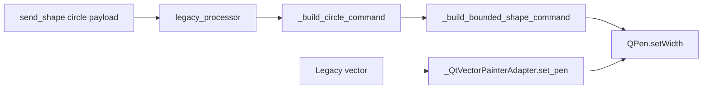

# Existing code findings

## Current paint flow

- The circle processor requires a positive integer `thickness` and stores it
  as `LegacyItem.data["thickness"]`.
- `_build_circle_command()` presently constructs
  `_StrokeWidthSpec(explicit_logical_width=item.get("thickness"))`.
- `_build_bounded_shape_command()` resolves that policy as
  `max(1, int(round(logical_width * group_ctx.scale)))`.
- `group_ctx.scale` is the Fit/Fill viewport scale for the legacy 1280×960
  canvas. At 1920×1080 in Fill mode it is 1.5, making a circle thickness of 1
  resolve to a two-pixel Qt pen.
- The comparison legacy vector does not use that path. Its adapter takes the
  configured `vector_line` width directly; the checked-in render config sets
  it to 1.

## Design implication

The bounded-shape helper must support two explicit width policies:

| Policy | Meaning | Consumer |
| --- | --- | --- |
| logical | multiply by Fit/Fill scale, round, minimum 1 | explicit rectangles |
| pixel | use requested Qt logical pixel width, round, minimum 1 | explicit circles |

The policy must be explicit in `_StrokeWidthSpec`; overloading the existing
rectangle default field would blur whether a value is a supplied thickness or
a renderer default.
