# VoiceAttack and Modern Overlay Integration

The instructions below are intended to assist you with configuring VoiceAttack with the E:D Market Connector Modern Overlay plugin, utilizing the EDMCHotkeys plugin.

The EDMCHotkeys plugin listens for configured keybinds to perform available and chosen commands as hotkeys. We take this a step further by utilizing VoiceAttack to listen to voice commands to perform keystrokes which are used by the EDMCHotKeys plugin as actions, all without having to physically touch the keyboard.

 

## Prerequisites 
[EDMCHotkeys](https://github.com/SweetJonnySauce/EDMCHotkeys) Plugin, Preinstalled  
[VoiceAttack](https://voiceattack.com/) (v2.x), Preinstalled

 

## Configuration Steps
### E:D Market Connector
After you have installed the EDMCHotkeys plugin into the E:D Market Connector application, navigate to the E:D Market Connector settings screen located under **File, Settings**.

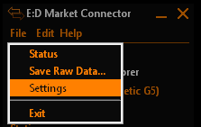

 

***EDMCHotkeys Plugin Screen***
1. Click the **Add Binding** button to add a new Hotkey action.
2. Click within the Hotkey field.
	- Using your keyboard, press the key combination you want to use for your first action.
		- This key combination will be detected and input into the field, in the order it understands.
		 - Some operating systems may not have all the keys detected properly. You may have to choose other key combinations to adjust for this.
		 - Ensure you do **not** use keybinds already in use by **Elite Dangerous** or other game tools.
3. Select the **EDMCModernOverlay** from the Plugin dropdown menu.
4. Select an action that you want to use with the Hotkey from the **Action** drop down menu.
5. Ensure the **Enabled** option is **Yes**.
	- Repeat Steps 1 - 5 to create desired bindings for each of the action options:
		- Overlay On
		- Overlay Off
		- Launch Overlay Controller
8. Click, **OK** to save and close the settings screen.

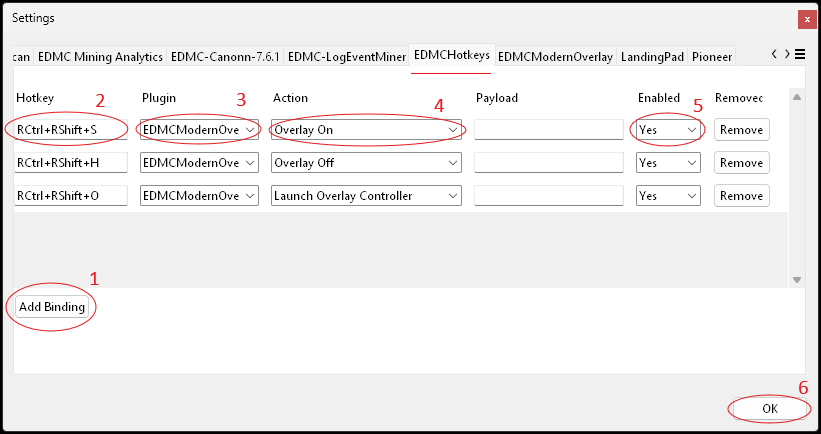

### VoiceAttack

 

1. Load VoiceAttack and Click on the **More Profile Actions** button.
2. Select **Create New Profile**.

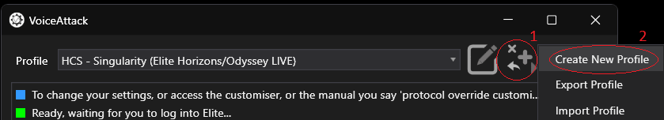

 

 

3. Choose a name to enter into the **Profile Name** field.
4. Click the **New Command** button.

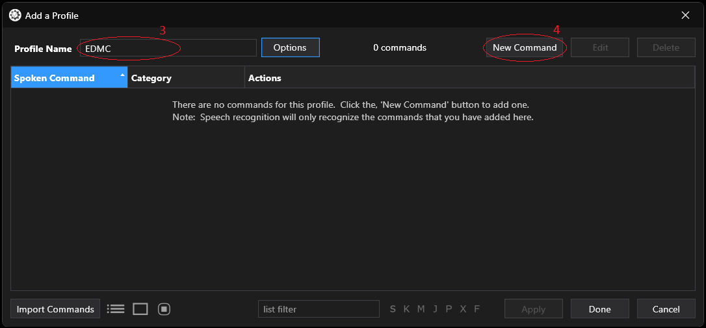

 

 

5. Ensure **When I say:** is **checked**, then enter the phrase you would like to say to activate the command, e.g. "Show Modern Overlay" or "Show Market Connector".

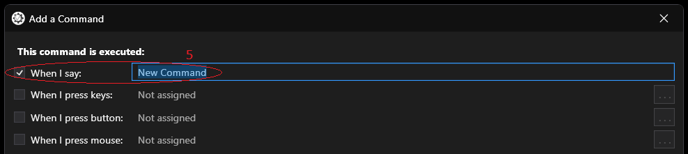

 

 

6. Click the **Key Press** button.
	- If the **Really important Key Press Tips - Please Read** message appears, click the **Close** button.

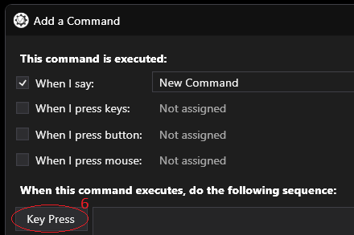

 

 

7. Ensure the **Key capture** toggle is **enabled** (generally the default and blue when active). 
	- Note: Image capture could not accurately grab this example. 
8. **Press** the **keyboard key or key combination** that you want VoiceAttack to perform when it carries out the voice command.
9. Ensure the **Press and Release Key(s)** option is selected.
10. Click the **OK** button.

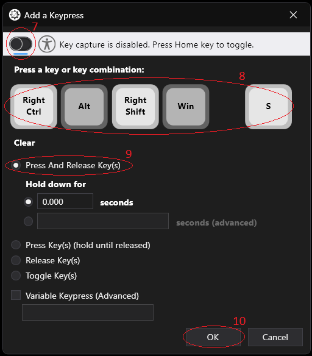

 

 

11. Click **Other >**, to add voice feedback after the voice command action has completed. 

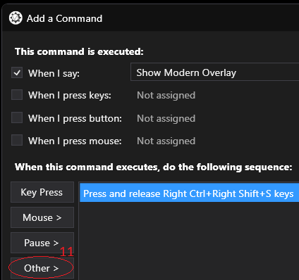

 

 

12. Click the **Sounds** flyout option.
13. Then click the **Say Something with Text-To-Speech** option.
	- You can be creative in the Sounds section, using built in system voices from a built-in text-to-speech engine or Play a Sound from pre-recorded audio clips that represent when the command has been recognized and executed. 

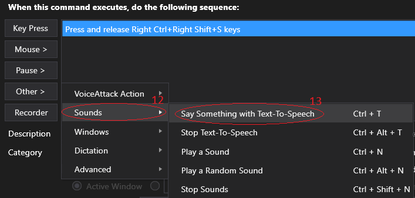

 

 

14. Enter the words or phrase you want to text-to-speech engine to say aloud, in the **text-to-speech** box, when the voice command action is performed, e.g. "Displaying E D Market Connectors Modern Overlay". 
15. Click the **OK** button.

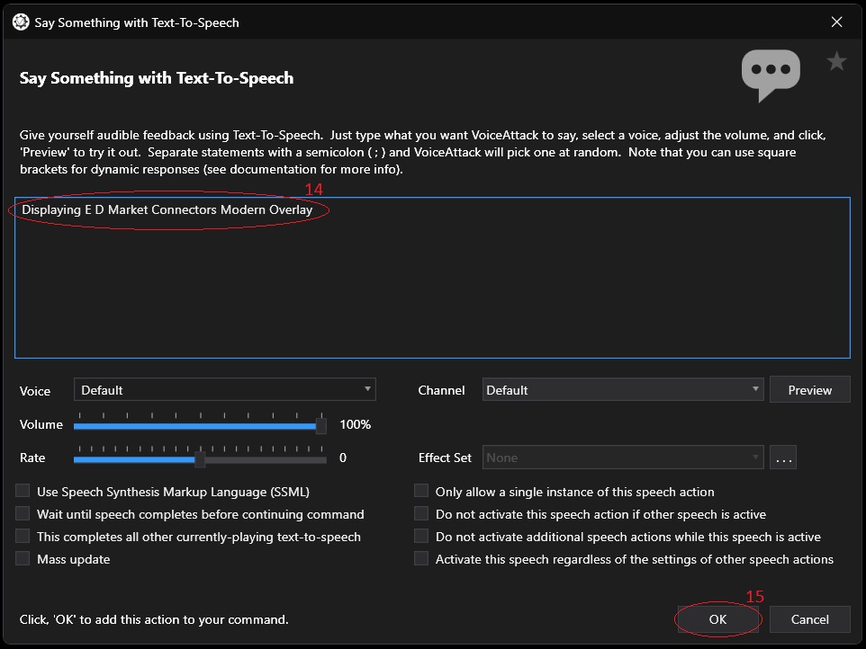

 

 

16. Enter descriptive text in the **Description** field, e.g. "Display the E:D Market Connector Modern Overlay".
17. Leave the **Send command to this target:**, **unchecked**. 
	- This defaults to the Active Window.
18. Click the **OK** button.
	- Repeat Steps 4-18 to add additional command action for coverage of:
		- Overlay On
		- Overlay Off
		- Launch Overlay Controller
			- Note: You can also duplicate commands quickly using alternate voice commands by right clicking an existing voice command and selecting, **Duplicate**.

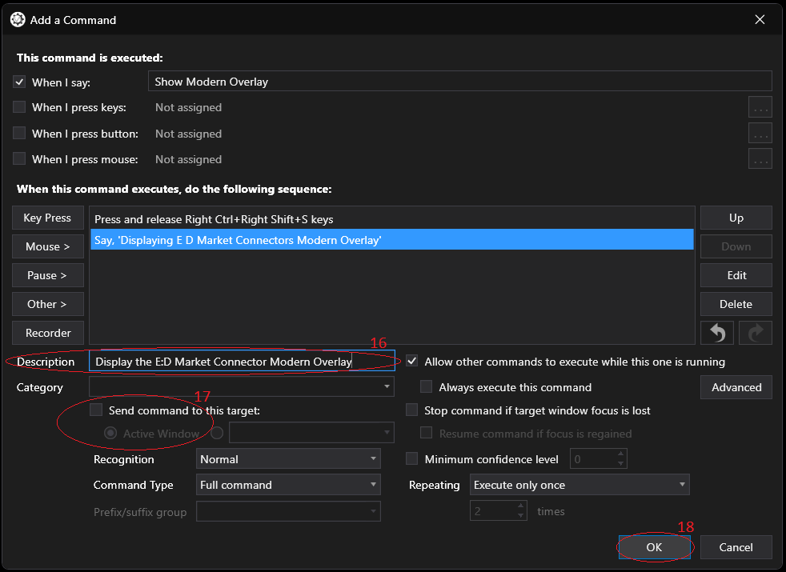

 

 

19. Click, **Done**, when you have completed adding or editing your voice commands and actions.

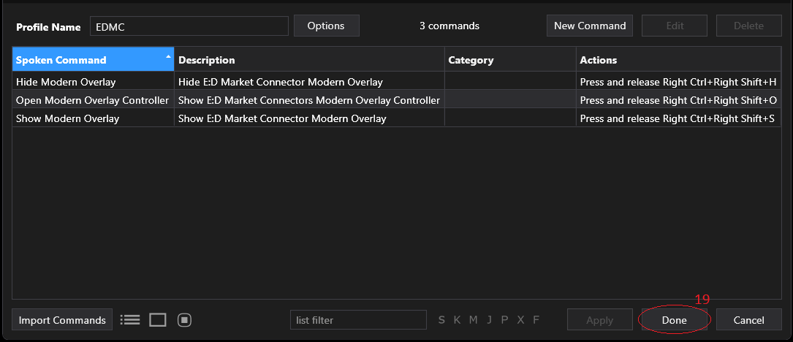

 

 

20. You are done at this stage if you are not using other VoiceAttack profiles or [HCS VOICEPACKS](https://www.hcsvoicepacks.com/collections/elite-dangerous) with Elite Dangerous.
	- Note: Ensure E:D Market Connector and VoiceAttack are running and your new VoiceAttack profile is loaded and in listening mode when playing Elite Dangerous.

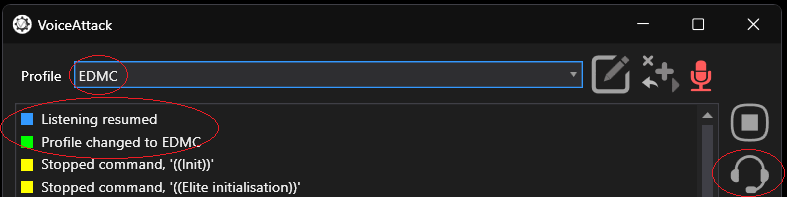

 

 

 #### VoiceAttack with other Profiles
 

If you are using VoiceAttack with other profiles such as, **HCS - Singularity (Elite Horizons/Odyssey LIVE)**, there are additional steps you must complete when using your customized voice commands simultaneously: 

 

 

1. **Switch** to your main Elite Dangerous profile, e.g. HCS - Singularity (Elite Horizons/Odyssey LIVE). 
2. Click the **Edit Profile** button. 

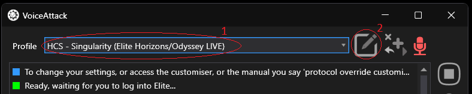

 

 

3. Click the **Options** button, in the **Edit a Profile** window.

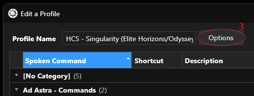

 

 

4. Click the ellipsis button **...** to the right of the **Include commands from other profiles:** field, within the **Profile Options** tab, in the **Profile General** window.

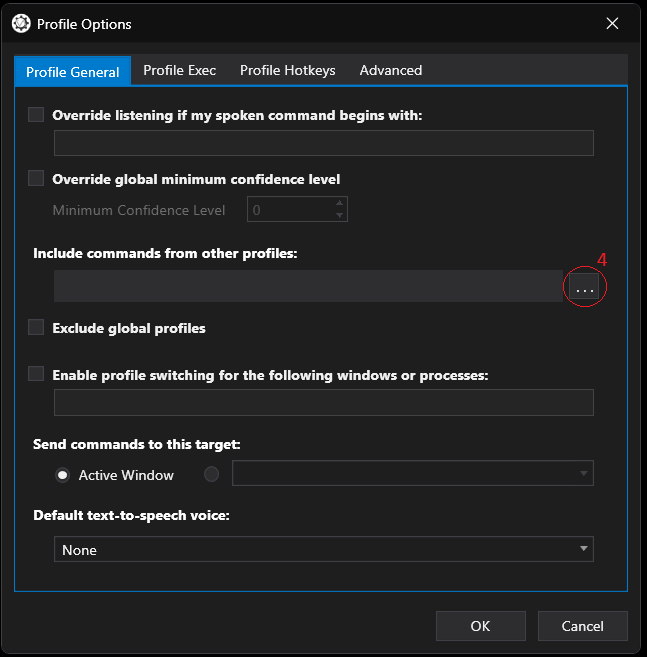

 

 

5. Click the **Plus** button, to add a profile to the list of included profiles.

 

 

6. **Select** the profile you created above from the dropdown list to include, e.g. "EDMC".
7. Then click the **OK** button. 

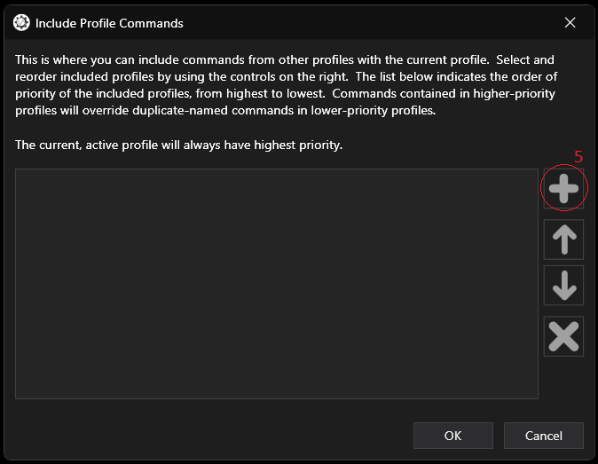

 

 

8. If necessary, reorder the list of included profiles, with the **Up** and **Down** arrows If you have more than one included profile in the list. 
	- Note: Higher profiles have higher priority.
9.  Then click the **OK** button.

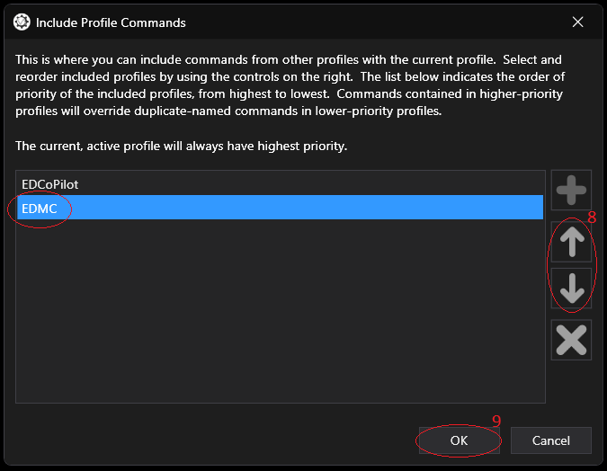

 

 

10. Click the **OK** button in the **Profile Options** window.

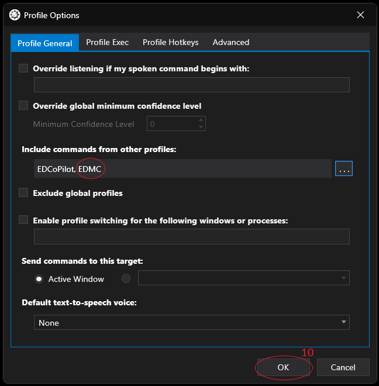

 

 

11. Click the **Done** button in the **Edit a Profile** window.

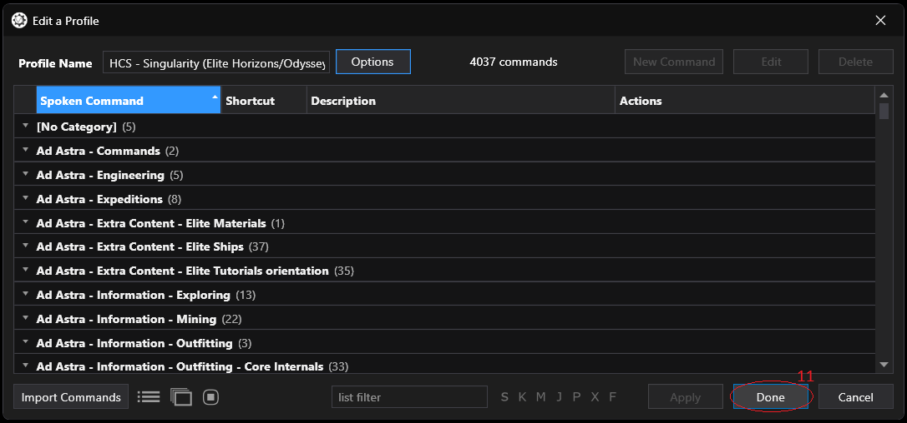

 

 

12. You are done combining your custom VoiceAttack profile with an existing profile. 
	- Note: Ensure E:D Market Connector and VoiceAttack are running and your new VoiceAttack profile is loaded and in listening mode when playing Elite Dangerous.

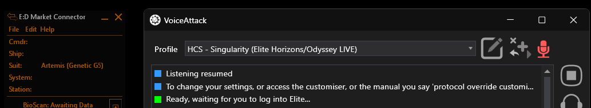

 

 

## Tips and Considerations

1. Validate desired overlays for installed plugins are enabled.
2. Use easily understood and remembered voice commands for improved use and recognition.
3. Not all EDMCHotkeys keybind or keybind combinations will work with all operating systems and versions. These instruction were tested on Windows 11 24H2 x64 at the time of writing.
